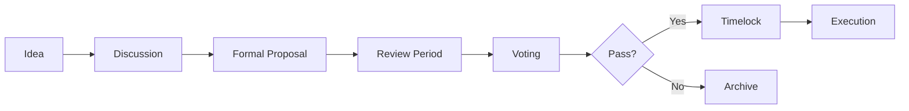

# DAO Governance Overview

## Decentralized Governance for the Temporal Era

ROKO Network operates as a fully decentralized autonomous organization (DAO), where token holders collectively make decisions about the protocol's future. Our innovative multi-token governance system prevents plutocratic control while rewarding active participation and expertise.

---

## Governance Philosophy

### Core Principles

1. **Temporal Fairness**: Decisions are time-ordered and transparent
2. **Merit-Based Influence**: Contribution quality matters more than token quantity
3. **Decentralized Control**: No single entity can dominate decisions
4. **Progressive Participation**: Reputation and involvement increase voting power
5. **Transparent Execution**: All proposals and votes are publicly verifiable

### Why Governance Matters

ROKO's governance controls critical protocol parameters:

- **Network upgrades** and technical improvements
- **Treasury allocation** for development and growth
- **Validator requirements** and slashing conditions
- **Economic parameters** like inflation and rewards
- **Strategic partnerships** and integrations
- **Grant programs** and ecosystem funding

---

## Multi-Token Governance System

### The Three Pillars of Voting Power

```
Total Voting Power = pwROKO + Reputation Multiplier + Working Group Weight
```

#### 1. pwROKO (Power ROKO)
- **Base voting power** from staked ROKO tokens
- **1:1 conversion** from ROKO
- **Non-transferable** to prevent vote buying
- **Instant unstaking** available (with cooldown)

#### 2. Reputation NFTs
- **Earned through participation** and contributions
- **Multiplies voting power** (1.1x to 2x)
- **Soulbound tokens** (non-transferable)
- **Progressive tiers**: Bronze → Silver → Gold → Diamond

#### 3. Working Group Membership
- **Specialized expertise** in key areas
- **Additional voting weight** on relevant proposals
- **Requires active contribution** and peer nomination

---

## Current Governance Statistics

| Metric | Value | Target |
|--------|-------|--------|
| **Total Participants** | 3,247 | 10,000 |
| **Active Voters (30d)** | 1,892 | 5,000 |
| **Proposals Passed** | 156 | - |
| **Average Turnout** | 42% | >50% |
| **Treasury Size** | 45M ROKO | 100M ROKO |
| **Avg Time to Execute** | 7 days | 5 days |

---

## How to Participate

### Step 1: Acquire Voting Power

```javascript
// Convert ROKO to pwROKO for voting power
const stake = await governance.stake({
    amount: '10000', // 10,000 ROKO
    duration: 'flexible' // or 'locked' for bonus
});

console.log('Your voting power:', stake.votingPower);
// Output: 10,000 pwROKO base power
```

### Step 2: Build Reputation

Earn reputation NFTs through various activities:

#### Participation Badges
- **First Vote**: Cast your first governance vote
- **Consistent Voter**: Vote in 10+ consecutive proposals
- **Early Adopter**: Join governance in the first year

#### Contribution Badges
- **Proposal Creator**: Successfully pass a proposal
- **Code Contributor**: Merge code into core repositories
- **Community Builder**: Onboard 50+ new members

#### Expertise Badges
- **Technical Expert**: Provide valuable technical feedback
- **Economic Advisor**: Contribute to tokenomics discussions
- **Security Auditor**: Identify and report vulnerabilities

### Step 3: Join a Working Group

Apply to specialized groups based on your expertise:

- **Technical Working Group**: Protocol development
- **Economic Working Group**: Tokenomics and incentives
- **Community Working Group**: Growth and engagement
- **Security Working Group**: Audits and vulnerability management
- **Partnership Working Group**: Strategic relationships

---

## Governance Process

### Proposal Lifecycle



### Phase 1: Discussion (3-7 days)
- Post idea in governance forum
- Gather community feedback
- Refine proposal based on input
- Find a sponsor if needed (100 pwROKO minimum)

### Phase 2: Formal Proposal
```typescript
interface Proposal {
    title: string;
    description: string;
    category: 'Technical' | 'Economic' | 'Community' | 'Emergency';
    impact: 'Low' | 'Medium' | 'High' | 'Critical';
    implementation: {
        timeline: string;
        resources: string[];
        responsible: Address[];
    };
    voting: {
        start: NanoMoment;
        end: NanoMoment;
        quorum: number; // Minimum participation
        threshold: number; // Minimum approval
    };
}
```

### Phase 3: Voting Period (3-7 days)

#### Voting Options
- **YES**: Support the proposal
- **NO**: Oppose the proposal
- **ABSTAIN**: Participate without opinion
- **NO WITH VETO**: Oppose and burn deposit (requires 33.4%)

#### Quorum Requirements
| Proposal Type | Quorum | Approval Threshold |
|--------------|--------|-------------------|
| **Technical** | 20% | 50% + 1 |
| **Economic** | 30% | 60% |
| **Emergency** | 15% | 66.7% |
| **Constitutional** | 40% | 75% |

### Phase 4: Timelock (2 days)
- Passed proposals enter timelock
- Allows for final review and preparation
- Emergency cancel possible with 80% vote

### Phase 5: Execution
- Automatic on-chain execution
- Temporal ordering ensures fairness
- Results published to all channels

---

## Voting Power Calculation

### Base Formula

```javascript
function calculateVotingPower(address) {
    // Base power from staked tokens
    let power = getPwROKOBalance(address);
    
    // Apply reputation multiplier
    const reputation = getReputationScore(address);
    const multiplier = calculateMultiplier(reputation);
    power *= multiplier;
    
    // Add working group bonus
    const workingGroups = getWorkingGroupMembership(address);
    workingGroups.forEach(group => {
        if (proposalRelevantToGroup(group)) {
            power *= 1.2; // 20% bonus for relevant expertise
        }
    });
    
    // Apply participation decay (use it or lose it)
    const lastVote = getLastVoteTime(address);
    const daysSinceVote = (now() - lastVote) / 86400;
    if (daysSinceVote > 30) {
        power *= Math.max(0.5, 1 - (daysSinceVote / 365));
    }
    
    return power;
}
```

### Reputation Multipliers

| Reputation Tier | Score Required | Multiplier | Benefits |
|----------------|---------------|------------|----------|
| **None** | 0 | 1.0x | Base voting power |
| **Bronze** | 100 | 1.1x | Access to pre-voting discussions |
| **Silver** | 500 | 1.25x | Can sponsor proposals |
| **Gold** | 1,000 | 1.5x | Working group eligibility |
| **Diamond** | 5,000 | 2.0x | Constitutional proposal rights |
| **Legendary** | 10,000 | 2.5x | Veto power in emergencies |

---

## Treasury Management

### Current Allocation

```
Total Treasury: 45,000,000 ROKO

├── Development Fund (40%)
│   ├── Core Protocol: 8M ROKO
│   ├── SDK/Tools: 4M ROKO
│   └── Infrastructure: 6M ROKO
│
├── Growth Fund (30%)
│   ├── Marketing: 5M ROKO
│   ├── Partnerships: 4.5M ROKO
│   └── Community Events: 4M ROKO
│
├── Security Fund (15%)
│   ├── Audits: 3M ROKO
│   ├── Bug Bounties: 2M ROKO
│   └── Insurance: 1.75M ROKO
│
└── Reserve Fund (15%)
    └── Emergency Reserve: 6.75M ROKO
```

### Spending Controls

#### Multi-Signature Requirements
| Amount | Signatures Required | Timelock |
|--------|-------------------|----------|
| < 10K ROKO | 2 of 5 | None |
| 10K - 100K | 3 of 7 | 24 hours |
| 100K - 1M | 5 of 9 | 3 days |
| > 1M ROKO | 7 of 11 + DAO vote | 7 days |

---

## Working Groups

### Technical Working Group

**Responsibilities:**
- Protocol upgrades and improvements
- Code review and testing
- Technical documentation
- Performance optimization

**Current Initiatives:**
- Implementing sub-nanosecond precision
- Cross-chain temporal bridges
- Zero-knowledge proof integration

### Economic Working Group

**Responsibilities:**
- Tokenomics optimization
- Inflation/deflation parameters
- Staking rewards adjustment
- Treasury management strategy

**Current Initiatives:**
- Dynamic fee adjustment mechanism
- Validator incentive restructuring
- Cross-chain liquidity programs

### Community Working Group

**Responsibilities:**
- Community growth initiatives
- Educational content creation
- Event organization
- Ambassador program management

**Current Initiatives:**
- Global hackathon series
- University partnerships
- Developer onboarding program

### Security Working Group

**Responsibilities:**
- Security audits coordination
- Vulnerability assessment
- Incident response planning
- Bug bounty management

**Current Initiatives:**
- Formal verification of core contracts
- Quantum-resistant cryptography research
- Network monitoring improvements

### Partnership Working Group

**Responsibilities:**
- Strategic partnership evaluation
- Integration planning
- Business development
- Enterprise engagement

**Current Initiatives:**
- Fortune 500 pilot programs
- Cross-chain collaborations
- Institutional validator onboarding

---

## Delegation System

### How Delegation Works

Token holders can delegate their voting power to experts:

```javascript
// Delegate voting power
const delegation = await governance.delegate({
    delegateTo: '0xExpertAddress',
    amount: 'all', // or specific amount
    topics: ['Technical', 'Security'], // optional: specific categories
    duration: 90 // days
});

// Revoke delegation anytime
await governance.revokeDelegation(delegation.id);
```

### Choosing a Delegate

#### Delegate Metrics
| Delegate | Voting History | Expertise | Success Rate | Delegated Power |
|----------|---------------|-----------|--------------|-----------------|
| Alice.eth | 142/150 votes | Technical, Security | 89% | 2.3M pwROKO |
| Bob.eth | 98/150 votes | Economic, Treasury | 76% | 1.8M pwROKO |
| Carol.eth | 150/150 votes | Community, Growth | 92% | 3.1M pwROKO |

### Becoming a Delegate

Requirements:
- Minimum 1,000 pwROKO self-stake
- Silver reputation or higher
- Published delegation platform
- 80% participation rate

---

## Proposal Templates

### Technical Improvement Proposal (TIP)

```markdown
# TIP-XXX: [Title]

## Summary
Brief description of the technical change

## Motivation
Why this change is necessary

## Specification
Detailed technical specification

## Implementation
- Timeline: X weeks
- Resources: Y developers
- Testing: Z weeks

## Security Considerations
Potential risks and mitigations

## Vote
- YES: Implement this change
- NO: Do not implement
```

### Economic Adjustment Proposal (EAP)

```markdown
# EAP-XXX: [Title]

## Current State
Existing economic parameters

## Proposed Changes
New parameters and rationale

## Economic Impact
- Token supply effects
- Staking reward changes
- Fee adjustments

## Modeling Results
Simulation data and projections

## Vote
- YES: Accept new parameters
- NO: Keep current parameters
```

---

## Emergency Procedures

### Emergency Proposals

For critical security issues or time-sensitive matters:

- **Reduced quorum**: 15% participation
- **Shortened voting**: 24 hours
- **Immediate execution**: No timelock
- **Higher threshold**: 66.7% approval

### Circuit Breaker

In extreme circumstances, a circuit breaker can be triggered:

1. **Security Working Group** identifies critical vulnerability
2. **3 of 5 security members** sign emergency transaction
3. **Temporary pause** of affected functions (max 72 hours)
4. **Emergency proposal** submitted for permanent fix
5. **Post-mortem** published after resolution

---

## Governance Analytics

### Real-Time Metrics Dashboard

Access governance analytics at [governance.roko.network](https://governance.roko.network)

- **Participation trends** over time
- **Voting power distribution** charts
- **Proposal success rates** by category
- **Delegate performance** rankings
- **Treasury flow** visualization

### Historical Data

All governance actions are recorded on-chain and queryable:

```graphql
query GovernanceHistory {
  proposals(orderBy: timestamp, orderDirection: desc) {
    id
    title
    proposer
    status
    votes {
      voter
      power
      choice
      timestamp
    }
    execution {
      timestamp
      transactionHash
    }
  }
}
```

---

## Best Practices

### For Voters

1. **Stay Informed**: Read proposals thoroughly before voting
2. **Participate Regularly**: Maintain your reputation multiplier
3. **Delegate Wisely**: Choose delegates aligned with your values
4. **Provide Feedback**: Comment on proposals during discussion
5. **Think Long-term**: Consider protocol sustainability

### For Proposers

1. **Start with Discussion**: Gauge community interest first
2. **Be Specific**: Provide clear implementation details
3. **Include Metrics**: Define success criteria
4. **Consider Impact**: Assess effects on all stakeholders
5. **Respond to Feedback**: Iterate based on community input

---

## Governance Roadmap

### Q1 2025: Foundation
- ✅ Launch multi-token governance
- ✅ Establish working groups
- ⏳ Deploy delegation system

### Q2 2025: Enhancement
- ⏳ Implement quadratic voting option
- ⏳ Launch prediction markets for proposals
- ⏳ Add cross-chain governance participation

### Q3 2025: Automation
- ⏳ AI-assisted proposal analysis
- ⏳ Automated execution framework
- ⏳ Real-time sentiment analysis

### Q4 2025: Decentralization
- ⏳ Remove all admin keys
- ⏳ Fully autonomous treasury
- ⏳ Immutable governance contracts

---

## Get Involved

### Quick Start Actions

1. **Stake ROKO for pwROKO**: [Staking Portal](https://stake.roko.network)
2. **Join Discord Governance Channel**: [Discord](https://discord.gg/roko-gov)
3. **Review Active Proposals**: [Governance Forum](https://gov.roko.network)
4. **Apply to Working Group**: [Application Form](https://apply.roko.network)
5. **Become a Delegate**: [Delegate Platform](https://delegates.roko.network)

### Resources

- 📚 [Governance Documentation](./structure.md)
- 🗳️ [Voting Guide](./voting.md)
- 💰 [Treasury Details](./treasury.md)
- 👥 [Working Groups](./working-groups.md)
- 📊 [Analytics Dashboard](https://analytics.roko.network)

---

<div align="center">

**Shape the Future of Temporal Blockchain**

Join 3,000+ community members actively governing ROKO Network

[Start Voting](https://vote.roko.network) | [View Proposals](https://gov.roko.network) | [Join Discord](https://discord.gg/roko)

</div>