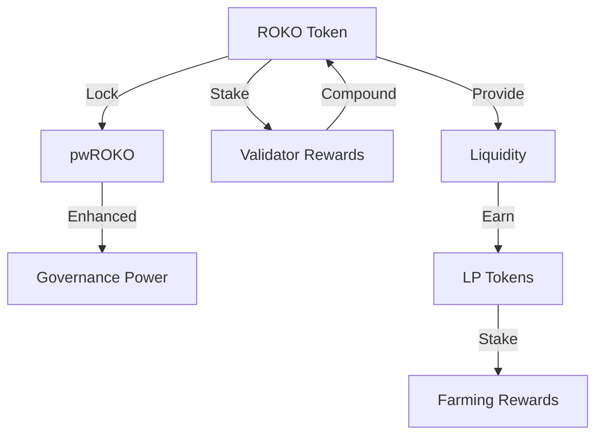
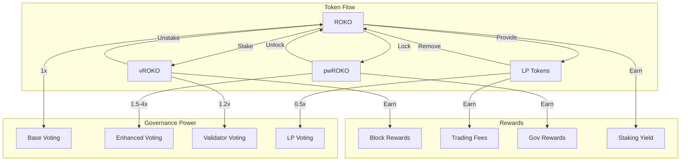

# Multi-Token System

The ROKO Network employs a sophisticated multi-token governance model that balances stakeholder interests and prevents governance attacks.

## Token Overview

### Token Ecosystem



### Token Specifications

| Token | Type | Supply | Primary Use | Transferable |
|-------|------|--------|-------------|-------------|
| **ROKO** | Utility | 1B | Staking, Fees, Governance | Yes |
| **pwROKO** | Governance | Variable | Enhanced Voting | No |
| **vROKO** | Validator | Variable | Validator Rights | No |
| **LP-ROKO** | Liquidity | Variable | Liquidity Provision | Yes |

## ROKO Token

### Utility Functions

```javascript
interface IROKOToken {
    // Core ERC20
    function transfer(address to, uint256 amount) external returns (bool);
    function approve(address spender, uint256 amount) external returns (bool);
    function transferFrom(address from, address to, uint256 amount) external returns (bool);
    
    // Governance
    function delegate(address delegatee) external;
    function getCurrentVotes(address account) external view returns (uint256);
    function getPriorVotes(address account, uint256 blockNumber) external view returns (uint256);
    
    // Staking
    function stake(uint256 amount, uint256 duration) external returns (uint256);
    function unstake(uint256 stakeId) external;
    
    // Temporal Features
    function getVotesAtTime(address account, uint256 nanotime) external view returns (uint256);
    function temporalTransfer(address to, uint256 amount, uint256 executeAt) external returns (bytes32);
}
```

### Token Distribution

```yaml
Total Supply: 1,000,000,000 ROKO

Allocation:
  Team & Advisors: 15% (4-year vesting)
  Investors: 20% (2-year vesting)
  Treasury: 25% (DAO controlled)
  Validators: 15% (Mining rewards)
  Ecosystem: 15% (Grants, partnerships)
  Public Sale: 10% (Immediate)

Vesting Schedule:
  Team: 6-month cliff, then linear over 42 months
  Investors: 3-month cliff, then linear over 21 months
  Advisors: 12-month cliff, then linear over 36 months
```

## pwROKO (Power-Weighted ROKO)

### Conversion Mechanics

```solidity
contract PowerROKO {
    struct Lock {
        uint256 amount;
        uint256 multiplier;
        uint256 unlockTime;
        uint256 votingPower;
    }
    
    mapping(address => Lock[]) public locks;
    
    function convertToPwROKO(
        uint256 amount,
        uint256 lockDuration
    ) external returns (uint256 pwRokoAmount) {
        require(amount >= MIN_LOCK_AMOUNT, "Below minimum");
        require(lockDuration >= MIN_LOCK_DURATION, "Lock too short");
        
        // Transfer ROKO
        rokoToken.transferFrom(msg.sender, address(this), amount);
        
        // Calculate multiplier based on lock duration
        uint256 multiplier = calculateMultiplier(lockDuration);
        pwRokoAmount = amount * multiplier / 100;
        
        // Create lock
        locks[msg.sender].push(Lock({
            amount: amount,
            multiplier: multiplier,
            unlockTime: block.timestamp + lockDuration,
            votingPower: pwRokoAmount
        }));
        
        // Mint pwROKO (non-transferable)
        _mint(msg.sender, pwRokoAmount);
        
        emit Converted(msg.sender, amount, pwRokoAmount, lockDuration);
    }
    
    function calculateMultiplier(uint256 duration) public pure returns (uint256) {
        if (duration < 30 days) return 100;      // 1x
        if (duration < 90 days) return 110;      // 1.1x
        if (duration < 180 days) return 130;     // 1.3x
        if (duration < 365 days) return 160;     // 1.6x
        if (duration < 730 days) return 200;     // 2x
        return 300;                              // 3x for 2+ years
    }
}
```

### pwROKO Benefits

| Lock Duration | Multiplier | Voting Power | Additional Benefits |
|---------------|------------|--------------|--------------------|
| 30 days | 1.1x | 1.2x | Priority proposals |
| 90 days | 1.3x | 1.5x | Reduced fees |
| 180 days | 1.6x | 2.0x | Working group eligibility |
| 1 year | 2.0x | 3.0x | Treasury access |
| 2 years | 3.0x | 4.0x | Guardian eligibility |

## vROKO (Validator ROKO)

### Validator Token Mechanics

```solidity
contract ValidatorROKO {
    struct ValidatorStake {
        uint256 rokoStaked;
        uint256 vRokoBalance;
        uint256 activationTime;
        uint256 performanceScore;
        bool isActive;
    }
    
    mapping(address => ValidatorStake) public validators;
    
    function becomeValidator(uint256 stakeAmount) external {
        require(stakeAmount >= MIN_VALIDATOR_STAKE, "Insufficient stake");
        require(!validators[msg.sender].isActive, "Already validator");
        
        // Lock ROKO
        rokoToken.transferFrom(msg.sender, address(this), stakeAmount);
        
        // Calculate vROKO based on stake and network needs
        uint256 vRokoAmount = calculateVROKO(stakeAmount);
        
        validators[msg.sender] = ValidatorStake({
            rokoStaked: stakeAmount,
            vRokoBalance: vRokoAmount,
            activationTime: block.timestamp,
            performanceScore: 100,
            isActive: true
        });
        
        // Grant validator privileges
        _grantValidatorRole(msg.sender);
        
        emit ValidatorActivated(msg.sender, stakeAmount, vRokoAmount);
    }
    
    function calculateVROKO(uint256 stake) private view returns (uint256) {
        // Dynamic calculation based on network needs
        uint256 activeValidators = getActiveValidatorCount();
        uint256 targetValidators = 150;
        
        if (activeValidators < targetValidators) {
            // Bonus for early validators
            return stake * 120 / 100;
        } else {
            // Standard rate
            return stake;
        }
    }
}
```

### Validator Rights & Responsibilities

```yaml
Rights:
  - Block production priority
  - Attestation fees (0.01% of transactions)
  - Governance proposals (reduced cost)
  - Working group participation
  - Emergency action voting

Responsibilities:
  - Maintain 99%+ uptime
  - Time sync accuracy < 1ms
  - Participate in governance
  - Secure infrastructure
  - Regular software updates

Penalties:
  - Downtime > 4 hours: 0.1% slash
  - Time drift > 10ms: 0.5% slash
  - Double signing: 5% slash
  - Malicious behavior: 100% slash
```

## Liquidity Tokens

### LP Token Mechanics

```solidity
contract ROKOLiquidityPool {
    using SafeMath for uint256;
    
    IERC20 public immutable roko;
    IERC20 public immutable pairedToken;
    IERC20 public immutable lpToken;
    
    uint256 public totalLiquidity;
    mapping(address => uint256) public liquidity;
    
    function addLiquidity(
        uint256 rokoAmount,
        uint256 pairedAmount
    ) external returns (uint256 lpAmount) {
        // Transfer tokens
        roko.transferFrom(msg.sender, address(this), rokoAmount);
        pairedToken.transferFrom(msg.sender, address(this), pairedAmount);
        
        // Calculate LP tokens
        if (totalLiquidity == 0) {
            lpAmount = sqrt(rokoAmount.mul(pairedAmount));
        } else {
            lpAmount = min(
                rokoAmount.mul(totalLiquidity) / roko.balanceOf(address(this)),
                pairedAmount.mul(totalLiquidity) / pairedToken.balanceOf(address(this))
            );
        }
        
        // Mint LP tokens
        lpToken.mint(msg.sender, lpAmount);
        liquidity[msg.sender] = liquidity[msg.sender].add(lpAmount);
        totalLiquidity = totalLiquidity.add(lpAmount);
        
        emit LiquidityAdded(msg.sender, rokoAmount, pairedAmount, lpAmount);
    }
}
```

### LP Staking Rewards

```javascript
const calculateLPRewards = (lpAmount, duration, pool) => {
    const baseAPR = 0.12; // 12% base APR
    
    // Bonuses
    const poolMultiplier = POOL_MULTIPLIERS[pool]; // 1x - 3x
    const durationBonus = Math.min(duration / 365, 2); // Up to 2x for 2 years
    const stabilityBonus = pool.includes('USDC') ? 1.2 : 1.0;
    
    const effectiveAPR = baseAPR * poolMultiplier * durationBonus * stabilityBonus;
    const dailyReward = (lpAmount * effectiveAPR) / 365;
    
    return {
        daily: dailyReward,
        monthly: dailyReward * 30,
        annual: dailyReward * 365,
        apr: effectiveAPR * 100
    };
};
```

## Token Interactions

### Cross-Token Mechanics



### Combined Governance Power

```python
def calculate_total_governance_power(address):
    power = 0
    
    # Base ROKO (1:1)
    roko_balance = get_roko_balance(address)
    power += roko_balance
    
    # pwROKO (1.5x - 4x based on lock)
    for lock in get_pwroko_locks(address):
        multiplier = get_lock_multiplier(lock.duration)
        power += lock.amount * multiplier
    
    # vROKO (1.2x if active validator)
    if is_active_validator(address):
        vroko_balance = get_vroko_balance(address)
        power += vroko_balance * 1.2
    
    # LP tokens (0.5x to prevent manipulation)
    lp_balance = get_lp_balance(address)
    power += lp_balance * 0.5
    
    # Apply reputation multiplier
    reputation = get_reputation_score(address)
    reputation_multiplier = 1 + (reputation / 200)  # Up to 1.5x
    power *= reputation_multiplier
    
    # Quadratic scaling for large holders
    if power > WHALE_THRESHOLD:
        power = math.sqrt(power) * SCALING_FACTOR
    
    return power
```

## Token Economics

### Inflation Schedule

```yaml
Year 1: 5% inflation
  - Validators: 60%
  - Treasury: 20%
  - LP Rewards: 15%
  - Governance: 5%

Year 2-5: 3% inflation
  - Validators: 50%
  - Treasury: 25%
  - LP Rewards: 20%
  - Governance: 5%

Year 6+: 1% inflation
  - Validators: 40%
  - Treasury: 30%
  - LP Rewards: 25%
  - Governance: 5%
```

### Fee Distribution

```solidity
contract FeeDistribution {
    uint256 constant VALIDATOR_SHARE = 70;
    uint256 constant TREASURY_SHARE = 20;
    uint256 constant BURN_SHARE = 10;
    
    function distributeFees(uint256 fees) external {
        uint256 validatorFees = fees * VALIDATOR_SHARE / 100;
        uint256 treasuryFees = fees * TREASURY_SHARE / 100;
        uint256 burnAmount = fees * BURN_SHARE / 100;
        
        // Distribute to validators based on stake
        distributeToValidators(validatorFees);
        
        // Send to treasury
        treasury.transfer(treasuryFees);
        
        // Burn tokens (deflationary)
        rokoToken.burn(burnAmount);
        
        emit FeesDistributed(validatorFees, treasuryFees, burnAmount);
    }
}
```

## Token Migration

### Legacy Token Support

```javascript
const migrateTokens = async (legacyTokenAddress, amount) => {
    // Verify legacy token
    const isValid = await verifyLegacyToken(legacyTokenAddress);
    if (!isValid) throw new Error("Invalid legacy token");
    
    // Calculate conversion rate
    const rate = await getConversionRate(legacyTokenAddress);
    const rokoAmount = amount * rate;
    
    // Lock legacy tokens
    await legacyToken.transferFrom(user, BURN_ADDRESS, amount);
    
    // Mint new ROKO tokens
    await rokoToken.mint(user, rokoAmount);
    
    // Optional: Bonus for early migration
    if (Date.now() < EARLY_MIGRATION_DEADLINE) {
        const bonus = rokoAmount * 0.1; // 10% bonus
        await rokoToken.mint(user, bonus);
    }
    
    return rokoAmount;
};
```

## Security Measures

### Token Protection

```solidity
contract TokenSecurity {
    mapping(address => bool) public blacklisted;
    mapping(address => uint256) public dailyLimit;
    mapping(address => uint256) public dailySpent;
    
    modifier notBlacklisted(address account) {
        require(!blacklisted[account], "Account blacklisted");
        _;
    }
    
    modifier withinDailyLimit(address account, uint256 amount) {
        require(
            dailySpent[account] + amount <= dailyLimit[account],
            "Daily limit exceeded"
        );
        _;
    }
    
    function emergencyPause() external onlyGuardian {
        _pause();
        emit EmergencyPause(msg.sender, block.timestamp);
    }
}
```

## Analytics & Metrics

### Token Metrics Dashboard

```python
class TokenMetrics:
    def get_current_metrics(self):
        return {
            'roko': {
                'price': self.get_price('ROKO'),
                'market_cap': self.get_market_cap('ROKO'),
                'circulating': self.get_circulating_supply('ROKO'),
                'staked': self.get_staked_amount('ROKO'),
                'locked': self.get_locked_amount('ROKO')
            },
            'pwroko': {
                'total_locked': self.get_total_locked(),
                'average_lock': self.get_average_lock_duration(),
                'unlock_schedule': self.get_unlock_schedule()
            },
            'vroko': {
                'validators': self.get_validator_count(),
                'total_staked': self.get_validator_stake(),
                'average_stake': self.get_average_validator_stake()
            },
            'liquidity': {
                'total_tvl': self.get_total_value_locked(),
                'pools': self.get_pool_metrics(),
                'volume_24h': self.get_trading_volume()
            }
        }
```

## Next Steps

- [Working Groups](./working-groups.md) - Group structure
- [Reputation System](./reputation.md) - Reputation mechanics
- [Proposal Process](./proposals.md) - Creating proposals
- [Treasury Management](./treasury.md) - Fund management

---

*Token Support: tokens@roko.network*