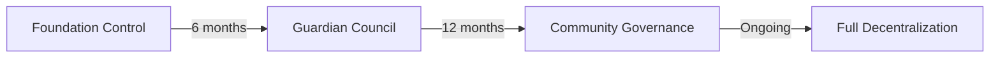
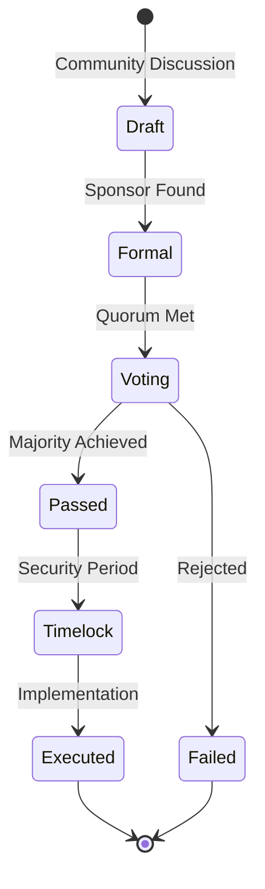

# 🏛️ DAO Overview

The ROKO Network DAO is a decentralized autonomous organization that governs the protocol through temporal consensus and community participation.

## Vision & Mission

### Vision
To create the world's first temporally-governed blockchain network where nanosecond precision enables fair, transparent, and MEV-resistant decision-making.

### Mission
- **Decentralize** protocol governance through community participation
- **Innovate** temporal consensus mechanisms for fair voting
- **Sustain** network growth through treasury management
- **Empower** stakeholders with meaningful governance rights

## Core Principles

### 1. Temporal Fairness
All governance actions are ordered by hardware-attested timestamps, preventing front-running and ensuring fair participation.

### 2. Progressive Decentralization


### 3. Stakeholder Representation
- **Validators**: Network security and performance
- **Token Holders**: Economic decisions
- **Developers**: Technical upgrades
- **Users**: Product features and priorities

## Governance Architecture

### Three-Tier System

#### Tier 1: Operational Decisions
- **Scope**: Day-to-day operations
- **Participants**: Working groups
- **Threshold**: Simple majority
- **Timeline**: 3-day voting period

#### Tier 2: Protocol Changes
- **Scope**: Parameter adjustments, feature additions
- **Participants**: Token holders + validators
- **Threshold**: 66% supermajority
- **Timeline**: 7-day voting period

#### Tier 3: Constitutional Changes
- **Scope**: Core protocol changes, tokenomics
- **Participants**: All stakeholders
- **Threshold**: 75% supermajority
- **Timeline**: 14-day voting period + 7-day timelock

## Governance Token

### ROKO Token Rights
```yaml
Voting Power:
  Base: 1 ROKO = 1 vote
  Time-locked: Up to 4x multiplier
  Delegation: Supported
  
Proposal Rights:
  Create: 10,000 ROKO minimum
  Emergency: 100,000 ROKO minimum
  Constitutional: 500,000 ROKO minimum
```

### pwROKO Enhanced Governance
- **Increased voting weight**: 1.5x to 4x based on lock duration
- **Proposal priority**: Earlier voting access
- **Veto rights**: For critical security issues
- **Working group participation**: Exclusive access

## Governance Process

### 1. Proposal Lifecycle


### 2. Voting Mechanisms

#### Temporal Ordering
All votes are ordered by nanosecond timestamps, preventing:
- Last-minute vote swings
- Governance attacks
- MEV extraction

#### Quadratic Voting
For certain proposals, quadratic voting reduces whale influence:
```python
voting_power = sqrt(token_balance) * time_weight
```

#### Delegation
- Liquid delegation supported
- Delegation chains up to 5 levels
- Automatic delegation for inactive accounts
- Revocable at any time

## Working Groups

### Active Groups

#### 1. Technical Committee
- **Focus**: Protocol development, upgrades
- **Members**: 7 core developers
- **Budget**: 500,000 ROKO/year
- **Mandate**: 2-year terms

#### 2. Treasury Council
- **Focus**: Fund management, grants
- **Members**: 5 financial experts
- **Budget**: Manages treasury
- **Mandate**: 1-year rotating terms

#### 3. Security Board
- **Focus**: Audits, incident response
- **Members**: 5 security experts
- **Budget**: 300,000 ROKO/year
- **Mandate**: Ongoing appointment

#### 4. Ecosystem Growth
- **Focus**: Partnerships, adoption
- **Members**: 9 community leaders
- **Budget**: 1,000,000 ROKO/year
- **Mandate**: 6-month terms

## Treasury Management

### Treasury Composition
```yaml
Total Value: ~$150M USD equivalent
Composition:
  ROKO: 40% (80M ROKO)
  Stablecoins: 30% ($45M USDC/USDT)
  ETH/BTC: 20% ($30M)
  Strategic Assets: 10% ($15M)
  
Allocation:
  Development: 40%
  Ecosystem Grants: 25%
  Marketing: 15%
  Operations: 10%
  Security: 5%
  Reserve: 5%
```

### Spending Limits
| Amount | Approval Required | Timelock |
|--------|------------------|----------|
| < $10k | Working Group | None |
| $10k - $100k | Treasury Council | 24 hours |
| $100k - $1M | Token Holder Vote | 3 days |
| > $1M | Supermajority Vote | 7 days |

## Governance Rewards

### Participation Incentives
```javascript
// Reward calculation
const calculateRewards = (participation) => {
  const base = 100; // 100 ROKO base reward
  const bonuses = {
    earlyVoting: participation.votedEarly ? 50 : 0,
    consistentVoting: participation.streak * 10,
    proposalCreation: participation.proposalsCreated * 500,
    workingGroup: participation.inWorkingGroup ? 200 : 0
  };
  
  return base + Object.values(bonuses).reduce((a, b) => a + b, 0);
};
```

### Reputation System
- **Voting streak**: Consecutive participation
- **Proposal quality**: Successful proposals
- **Community contribution**: Forum activity, code contributions
- **Time weight**: Longer participation = higher weight

## Emergency Procedures

### Guardian Multisig
- **Purpose**: Emergency protocol protection
- **Members**: 9 guardians (5/9 threshold)
- **Powers**: Pause, emergency upgrades
- **Sunset**: 24 months from launch

### Emergency Actions
1. **Pause Protocol**: Immediate, 24-hour duration
2. **Emergency Fix**: 48-hour timelock
3. **Fund Recovery**: 72-hour timelock
4. **Guardian Replacement**: 7-day timelock

## Transparency & Reporting

### On-chain Transparency
- All votes recorded on-chain
- Treasury movements public
- Proposal execution transparent
- Working group actions logged

### Regular Reports
- **Weekly**: Treasury snapshot
- **Monthly**: Governance metrics
- **Quarterly**: Comprehensive review
- **Annual**: State of the DAO

## Key Metrics

### Current Statistics
```yaml
Total Proposals: 247
Passed: 184 (74.5%)
Active Voters: 12,847
Average Participation: 34.2%
Total Treasury Value: $152.3M
Grants Distributed: $18.7M
Working Group Members: 26
```

### Governance Health
- **Nakamoto Coefficient**: 21 (voting power)
- **Gini Coefficient**: 0.67 (moderate decentralization)
- **Participation Rate**: 34.2% (above average)
- **Proposal Success Rate**: 74.5%

## Integration with Protocol

### Smart Contract Governance
```solidity
contract RokoGovernance {
    mapping(address => uint256) public votingPower;
    mapping(uint256 => Proposal) public proposals;
    
    function createProposal(
        string memory description,
        bytes memory execution
    ) external returns (uint256) {
        require(votingPower[msg.sender] >= MIN_PROPOSAL_THRESHOLD);
        // Temporal ordering ensures fair proposal creation
        uint256 nanoTime = ITimeOracle(timeOracle).getCurrentNanoTime();
        // ...
    }
}
```

## Future Roadmap

### Phase 1: Foundation (Months 0-6) ✅
- Launch DAO structure
- Initial treasury funding
- Guardian council established
- First proposals passed

### Phase 2: Growth (Months 6-12) 🔄
- Working groups operational
- Delegation system live
- Reputation system launch
- Cross-chain governance

### Phase 3: Maturity (Months 12-24)
- Guardian sunset begins
- Fully decentralized treasury
- Advanced voting mechanisms
- Inter-DAO collaborations

### Phase 4: Evolution (Months 24+)
- AI-assisted governance
- Predictive modeling
- Automated execution
- Cross-protocol coordination

## Getting Involved

### How to Participate
1. **Hold ROKO/pwROKO**: Acquire governance tokens
2. **Delegate or Vote**: Participate in decisions
3. **Create Proposals**: Submit improvement ideas
4. **Join Working Groups**: Apply for specialized roles
5. **Contribute**: Code, documentation, community

### Resources
- **Forum**: [forum.roko.network](https://forum.roko.network)
- **Voting**: [vote.roko.network](https://vote.roko.network)
- **Analytics**: [stats.roko.network/governance](https://stats.roko.network/governance)
- **Documentation**: [docs.roko.network/governance](https://docs.roko.network/governance)

## Contact & Support

- **Email**: governance@roko.network
- **Discord**: [discord.gg/roko-dao](https://discord.gg/roko-dao)
- **Twitter**: [@RokoDAO](https://twitter.com/RokoDAO)
- **Telegram**: [t.me/RokoGovernance](https://t.me/RokoGovernance)

---

*"Temporal consensus for timeless governance"*