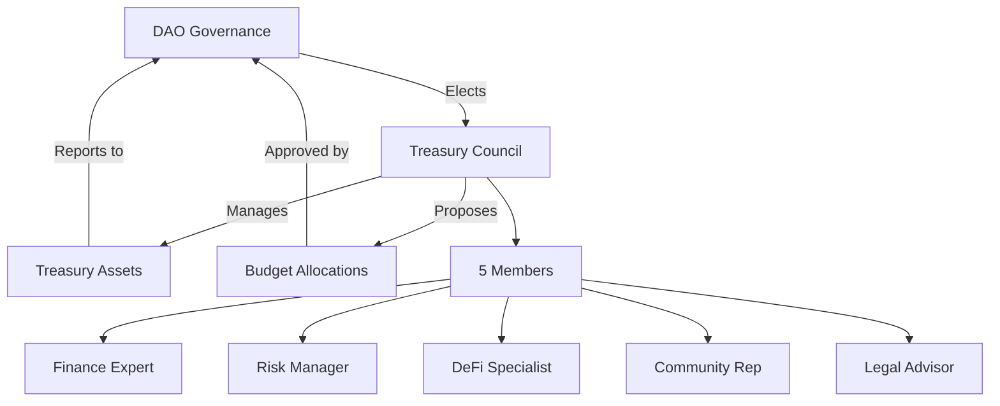
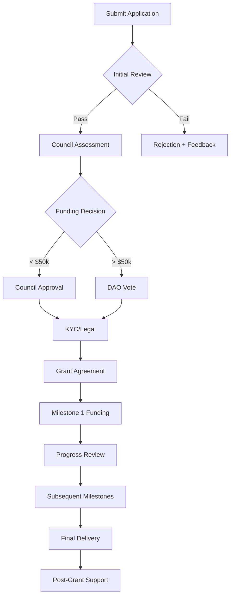

# 💰 Treasury Management

The ROKO Network Treasury is a decentralized fund managed by the DAO to support protocol development, ecosystem growth, and long-term sustainability.

## Treasury Overview

### Current Holdings

```yaml
Total Value: $156,743,291 USD
Last Updated: 2024-01-15 00:00:00 UTC

Assets:
  ROKO:
    Amount: 85,000,000
    Value: $68,000,000
    Allocation: 43.4%
    
  Stablecoins:
    USDC: $25,000,000
    USDT: $15,000,000
    DAI: $8,000,000
    Total: $48,000,000
    Allocation: 30.6%
    
  Major Cryptocurrencies:
    ETH: 5,000 ($12,500,000)
    BTC: 250 ($10,750,000)
    Total: $23,250,000
    Allocation: 14.8%
    
  Strategic Holdings:
    Partner Tokens: $10,493,291
    LP Positions: $7,000,000
    Total: $17,493,291
    Allocation: 11.2%
```

### Treasury Mandate

1. **Sustainability**: Ensure long-term protocol funding
2. **Growth**: Support ecosystem expansion
3. **Security**: Maintain emergency reserves
4. **Innovation**: Fund research and development
5. **Community**: Reward contributors and participants

## Governance Structure

### Treasury Council



### Multi-Signature Setup

```solidity
contract TreasuryMultisig {
    address[] public signers;
    uint256 public constant REQUIRED_SIGNATURES = 4;
    uint256 public constant TOTAL_SIGNERS = 7;
    
    struct Transaction {
        address to;
        uint256 value;
        bytes data;
        bool executed;
        uint256 confirmations;
        mapping(address => bool) isConfirmed;
    }
    
    mapping(uint256 => Transaction) public transactions;
    
    modifier onlySigner() {
        require(isSigner(msg.sender), "Not a signer");
        _;
    }
    
    function submitTransaction(
        address _to,
        uint256 _value,
        bytes memory _data
    ) public onlySigner returns (uint256) {
        uint256 txId = transactionCount++;
        
        transactions[txId] = Transaction({
            to: _to,
            value: _value,
            data: _data,
            executed: false,
            confirmations: 0
        });
        
        emit TransactionSubmitted(txId, msg.sender, _to, _value);
        return txId;
    }
}
```

## Budget Allocation

### Annual Budget Framework

```python
class AnnualBudget:
    def __init__(self, total_budget):
        self.total = total_budget
        self.allocations = {
            'development': {
                'percentage': 35,
                'amount': total_budget * 0.35,
                'categories': [
                    'core_protocol': 0.5,
                    'new_features': 0.3,
                    'maintenance': 0.2
                ]
            },
            'ecosystem_growth': {
                'percentage': 25,
                'amount': total_budget * 0.25,
                'categories': [
                    'grants': 0.4,
                    'partnerships': 0.3,
                    'hackathons': 0.2,
                    'education': 0.1
                ]
            },
            'operations': {
                'percentage': 15,
                'amount': total_budget * 0.15,
                'categories': [
                    'infrastructure': 0.4,
                    'legal': 0.3,
                    'admin': 0.3
                ]
            },
            'marketing': {
                'percentage': 10,
                'amount': total_budget * 0.10,
                'categories': [
                    'campaigns': 0.5,
                    'events': 0.3,
                    'content': 0.2
                ]
            },
            'security': {
                'percentage': 10,
                'amount': total_budget * 0.10,
                'categories': [
                    'audits': 0.5,
                    'bug_bounties': 0.3,
                    'monitoring': 0.2
                ]
            },
            'reserves': {
                'percentage': 5,
                'amount': total_budget * 0.05,
                'categories': [
                    'emergency': 0.6,
                    'opportunities': 0.4
                ]
            }
        }
```

### Spending Limits

| Amount | Approval Required | Timelock | Documentation |
|--------|------------------|----------|---------------|
| < $10k | Treasury Council (3/5) | None | Basic |
| $10k-$50k | Treasury Council (4/5) | 24 hours | Detailed |
| $50k-$250k | Token Vote (Simple) | 48 hours | Comprehensive |
| $250k-$1M | Token Vote (Super) | 72 hours | Full Audit |
| > $1M | Token Vote (75%) | 7 days | External Review |

## Investment Strategy

### Asset Allocation Policy

```javascript
const treasuryAllocation = {
    conservative: {
        stablecoins: 0.40,  // 40% in USDC, USDT, DAI
        roko: 0.35,         // 35% in native token
        bluechip: 0.15,     // 15% in ETH/BTC
        strategic: 0.10      // 10% in partner tokens
    },
    balanced: {
        stablecoins: 0.30,
        roko: 0.40,
        bluechip: 0.20,
        strategic: 0.10
    },
    growth: {
        stablecoins: 0.20,
        roko: 0.45,
        bluechip: 0.20,
        strategic: 0.15
    }
};

// Current strategy: Balanced
const currentAllocation = treasuryAllocation.balanced;
```

### Yield Generation

```solidity
contract TreasuryYield {
    struct YieldStrategy {
        address protocol;
        uint256 allocation;
        uint256 apy;
        uint256 risk; // 1-10 scale
        bool active;
    }
    
    YieldStrategy[] public strategies;
    
    function deployCapital(
        uint256 strategyId,
        uint256 amount
    ) external onlyTreasurer {
        YieldStrategy memory strategy = strategies[strategyId];
        require(strategy.active, "Strategy inactive");
        require(strategy.risk <= maxRisk, "Risk too high");
        
        // Deploy to yield protocol
        IERC20(baseAsset).approve(strategy.protocol, amount);
        IYieldProtocol(strategy.protocol).deposit(amount);
        
        emit CapitalDeployed(strategy.protocol, amount, strategy.apy);
    }
}
```

### Risk Management

```python
class RiskManagement:
    def __init__(self):
        self.risk_limits = {
            'single_asset_max': 0.30,      # Max 30% in single asset
            'volatile_assets_max': 0.40,    # Max 40% in volatile assets
            'illiquid_max': 0.15,           # Max 15% in illiquid positions
            'protocol_exposure_max': 0.20,   # Max 20% in single protocol
            'chain_exposure_max': 0.60       # Max 60% on single chain
        }
        
    def assess_portfolio_risk(self, holdings):
        risks = {
            'concentration': self.check_concentration_risk(holdings),
            'volatility': self.calculate_portfolio_volatility(holdings),
            'liquidity': self.assess_liquidity_risk(holdings),
            'smart_contract': self.evaluate_protocol_risks(holdings),
            'market': self.analyze_market_conditions()
        }
        
        overall_risk = self.calculate_risk_score(risks)
        return {
            'score': overall_risk,
            'rating': self.get_risk_rating(overall_risk),
            'recommendations': self.generate_recommendations(risks)
        }
```

## Grant Programs

### Grant Categories

```yaml
Development Grants:
  Budget: $5M/year
  Categories:
    - Protocol Development: $2M
    - Tool Development: $1.5M
    - SDK/Library: $1M
    - Documentation: $500k
  
Ecosystem Grants:
  Budget: $3M/year
  Categories:
    - DApp Development: $1.5M
    - Integration: $750k
    - Research: $500k
    - Education: $250k
    
Community Grants:
  Budget: $1M/year
  Categories:
    - Content Creation: $400k
    - Community Events: $300k
    - Translations: $200k
    - Ambassador Program: $100k
```

### Grant Application Process



### Grant Evaluation Criteria

```javascript
const evaluateGrant = (application) => {
    const criteria = {
        impact: {
            weight: 0.30,
            score: assessImpact(application),
            factors: ['user_reach', 'ecosystem_value', 'innovation']
        },
        feasibility: {
            weight: 0.25,
            score: assessFeasibility(application),
            factors: ['team_experience', 'timeline', 'technical_approach']
        },
        alignment: {
            weight: 0.20,
            score: assessAlignment(application),
            factors: ['protocol_goals', 'community_needs', 'strategic_fit']
        },
        sustainability: {
            weight: 0.15,
            score: assessSustainability(application),
            factors: ['long_term_viability', 'maintenance_plan', 'revenue_model']
        },
        value: {
            weight: 0.10,
            score: assessValue(application),
            factors: ['budget_efficiency', 'roi_potential', 'cost_benefit']
        }
    };
    
    const totalScore = Object.values(criteria).reduce(
        (sum, c) => sum + (c.score * c.weight), 0
    );
    
    return {
        score: totalScore,
        recommendation: totalScore > 70 ? 'APPROVE' : 'DENY',
        details: criteria
    };
};
```

## Revenue Streams

### Protocol Revenue

```python
class ProtocolRevenue:
    def __init__(self):
        self.revenue_streams = {
            'transaction_fees': {
                'rate': 0.001,  # 0.1%
                'monthly_volume': 500_000_000,
                'monthly_revenue': 500_000
            },
            'validator_fees': {
                'attestation_fee': 0.01,  # $0.01 per attestation
                'daily_attestations': 1_000_000,
                'monthly_revenue': 300_000
            },
            'time_oracle_fees': {
                'query_fee': 0.001,  # $0.001 per query
                'daily_queries': 5_000_000,
                'monthly_revenue': 150_000
            },
            'mev_capture': {
                'capture_rate': 0.5,  # 50% of MEV
                'monthly_mev': 400_000,
                'monthly_revenue': 200_000
            }
        }
        
    def calculate_monthly_revenue(self):
        total = sum(s['monthly_revenue'] 
                   for s in self.revenue_streams.values())
        return total  # $1,150,000/month
```

### Revenue Distribution

```solidity
contract RevenueDistribution {
    uint256 constant TREASURY_SHARE = 40;
    uint256 constant VALIDATOR_SHARE = 30;
    uint256 constant STAKER_SHARE = 20;
    uint256 constant BURN_SHARE = 10;
    
    function distributeRevenue() external {
        uint256 revenue = address(this).balance;
        
        // Treasury allocation
        uint256 treasuryAmount = revenue * TREASURY_SHARE / 100;
        treasury.transfer(treasuryAmount);
        
        // Validator rewards
        uint256 validatorAmount = revenue * VALIDATOR_SHARE / 100;
        distributeToValidators(validatorAmount);
        
        // Staking rewards
        uint256 stakerAmount = revenue * STAKER_SHARE / 100;
        stakingPool.transfer(stakerAmount);
        
        // Token burn (deflationary)
        uint256 burnAmount = revenue * BURN_SHARE / 100;
        burnTokens(burnAmount);
        
        emit RevenueDistributed(revenue, block.timestamp);
    }
}
```

## Expense Management

### Operating Expenses

```yaml
Monthly Operating Expenses:
  Infrastructure:
    Cloud Services: $50,000
    Node Operations: $30,000
    Data Storage: $20,000
    Monitoring: $10,000
    Total: $110,000
    
  Personnel:
    Core Team: $300,000
    Contractors: $150,000
    Advisors: $50,000
    Total: $500,000
    
  Services:
    Legal: $75,000
    Accounting: $25,000
    Security: $50,000
    Marketing: $100,000
    Total: $250,000
    
  Development:
    Audits: $100,000
    Tools/Licenses: $20,000
    Testing: $30,000
    Total: $150,000
    
Total Monthly: $1,010,000
Total Annual: $12,120,000
```

### Cost Optimization

```javascript
class CostOptimization {
    optimizeExpenses(expenses) {
        const strategies = [
            this.negotiateContracts(expenses.services),
            this.automateProcesses(expenses.operations),
            this.consolidateVendors(expenses.infrastructure),
            this.implementBudgetControls(expenses.all),
            this.reviewRecurringCosts(expenses.recurring)
        ];
        
        const savings = strategies.reduce((total, strategy) => {
            return total + strategy.estimatedSavings;
        }, 0);
        
        return {
            currentCosts: this.sumExpenses(expenses),
            potentialSavings: savings,
            savingsPercentage: (savings / this.sumExpenses(expenses)) * 100,
            recommendations: strategies
        };
    }
}
```

## Reporting & Transparency

### Monthly Treasury Report

```markdown
# ROKO Treasury Report - January 2024

## Executive Summary
- Total Value: $156.7M (+5.2% MoM)
- Revenue: $1.15M 
- Expenses: $1.01M
- Net Income: $140k

## Asset Performance
| Asset | Start | End | Change | % |
|-------|-------|-----|--------|---|
| ROKO | $65M | $68M | +$3M | +4.6% |
| Stables | $48M | $48M | $0 | 0% |
| ETH/BTC | $22M | $23.3M | +$1.3M | +5.9% |

## Key Transactions
- Grant Payment: $250k to Protocol Labs
- Infrastructure: $110k monthly costs
- Audit Payment: $150k to Certik

## Yield Generation
- Staking Rewards: $45k
- LP Fees: $32k
- Lending: $18k

## Upcoming Commitments
- Q2 Grants: $2M allocated
- Mainnet Launch: $500k reserved
- Marketing Campaign: $300k approved
```

### Real-Time Dashboard

```sql
-- Treasury metrics query
SELECT 
    asset_type,
    SUM(usd_value) as total_value,
    SUM(quantity) as total_quantity,
    AVG(price) as avg_price,
    MAX(last_updated) as last_update
FROM treasury_holdings
GROUP BY asset_type
ORDER BY total_value DESC;

-- Revenue tracking
SELECT 
    DATE_TRUNC('day', timestamp) as date,
    SUM(amount) as daily_revenue,
    COUNT(*) as transaction_count,
    AVG(amount) as avg_transaction
FROM treasury_income
WHERE timestamp > NOW() - INTERVAL '30 days'
GROUP BY date
ORDER BY date DESC;
```

## Emergency Procedures

### Crisis Management

```solidity
contract EmergencyTreasury {
    address public guardian;
    bool public emergencyMode = false;
    uint256 public emergencyWithdrawDelay = 24 hours;
    
    modifier onlyInEmergency() {
        require(emergencyMode, "Not in emergency");
        _;
    }
    
    function declareEmergency() external onlyGuardian {
        emergencyMode = true;
        emergencyDeclaredAt = block.timestamp;
        emit EmergencyDeclared(msg.sender, block.timestamp);
    }
    
    function emergencyWithdraw(
        address token,
        uint256 amount,
        address recipient
    ) external onlyGuardian onlyInEmergency {
        require(
            block.timestamp >= emergencyDeclaredAt + emergencyWithdrawDelay,
            "Delay not met"
        );
        
        IERC20(token).transfer(recipient, amount);
        emit EmergencyWithdraw(token, amount, recipient);
    }
}
```

## Audit & Compliance

### Audit Schedule

| Quarter | Auditor | Scope | Budget |
|---------|---------|-------|--------|
| Q1 2024 | Certik | Smart Contracts | $150k |
| Q2 2024 | Trail of Bits | Protocol Security | $200k |
| Q3 2024 | Quantstamp | DeFi Integrations | $175k |
| Q4 2024 | OpenZeppelin | Full Audit | $250k |

### Compliance Framework

```python
class ComplianceFramework:
    def __init__(self):
        self.requirements = {
            'kyc': ['council_members', 'large_recipients'],
            'aml': ['transaction_monitoring', 'suspicious_activity'],
            'tax': ['1099_filing', 'international_reporting'],
            'regulatory': ['securities_compliance', 'dao_registration']
        }
        
    def compliance_check(self, transaction):
        checks = [
            self.kyc_verification(transaction.recipient),
            self.aml_screening(transaction),
            self.sanctions_check(transaction.recipient),
            self.tax_reporting(transaction),
            self.regulatory_compliance(transaction)
        ]
        
        return all(checks)
```

## Contact & Support

- **Email**: treasury@roko.network
- **Dashboard**: [treasury.roko.network](https://treasury.roko.network)
- **Multisig**: `0x742d35Cc6634C0532925a3b844Bc8e70387657a`
- **Discord**: [discord.gg/roko-treasury](https://discord.gg/roko-treasury)

---

*"Building sustainable value for the ROKO ecosystem"*