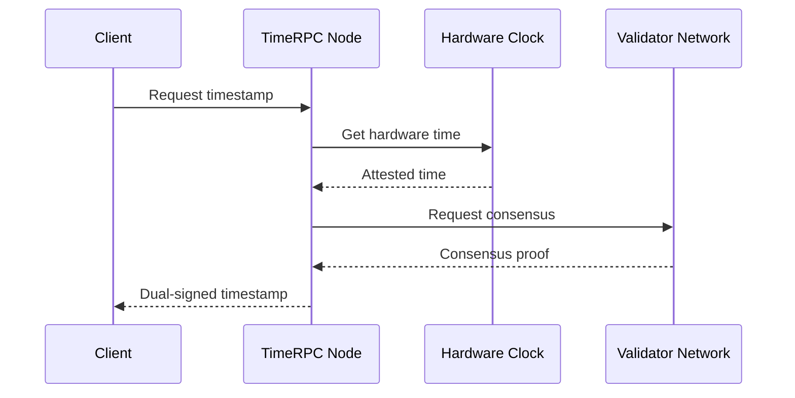

# TimeRPC Authority

## Decentralized Time Attestation Protocol

TimeRPC is ROKO Network's revolutionary protocol for providing cryptographically attested, hardware-verified timestamps with nanosecond precision to any application or smart contract.

## Overview

TimeRPC serves as the temporal oracle for the ROKO Network, providing:
- Hardware-attested timestamps
- Dual-signature verification
- Decentralized time consensus
- Cross-chain time bridging

## Architecture

### Protocol Stack

```
┌─────────────────────────────────┐
│     Application Layer           │
│   (Smart Contracts, DApps)      │
├─────────────────────────────────┐
│      TimeRPC API Layer          │
│   (REST, WebSocket, gRPC)       │
├─────────────────────────────────┐
│    Attestation Layer            │
│  (Dual Signatures, Proofs)      │
├─────────────────────────────────┐
│    Time Authority Layer         │
│   (Distributed Nodes)           │
├─────────────────────────────────┐
│     Hardware Layer              │
│   (OCP TAP 2.0 Cards)           │
└─────────────────────────────────┘
```

## Core Protocol

### Time Request Flow



### Message Format

```protobuf
syntax = "proto3";

message TimeRequest {
    string request_id = 1;
    uint64 nonce = 2;
    RequestType type = 3;
    bytes client_signature = 4;
    
    enum RequestType {
        CURRENT_TIME = 0;
        HISTORICAL_PROOF = 1;
        FUTURE_SCHEDULE = 2;
    }
}

message TimeResponse {
    string request_id = 1;
    uint128 nano_moment = 2;
    TimeProof proof = 3;
    NodeInfo node = 4;
    ConsensusProof consensus = 5;
}

message TimeProof {
    bytes hardware_signature = 1;
    bytes node_signature = 2;
    uint32 accuracy_ns = 3;
    string hardware_id = 4;
    GPSReference gps = 5;
}
```

## Dual Signature Mechanism

### Primary Signature (Hardware)

```rust
pub struct HardwareSignature {
    timestamp: NanoMoment,
    card_id: [u8; 32],
    signature: [u8; 64],
    certificate: X509Certificate,
}

impl HardwareSignature {
    pub fn create(moment: NanoMoment) -> Result<Self> {
        let card = TimeCard::get_instance()?;
        let signature = card.sign_timestamp(moment)?;
        
        Ok(HardwareSignature {
            timestamp: moment,
            card_id: card.id(),
            signature,
            certificate: card.certificate(),
        })
    }
}
```

### Secondary Signature (Node)

```python
class NodeSignature:
    def __init__(self, hardware_sig, node_key):
        self.hardware_sig = hardware_sig
        self.node_id = node_key.public_key
        self.timestamp = NanoMoment.now()
        
    def sign(self):
        # Create composite signature
        message = self.hardware_sig.bytes() + self.timestamp.bytes()
        self.signature = self.node_key.sign(message)
        
        return {
            'hardware': self.hardware_sig,
            'node': {
                'id': self.node_id,
                'timestamp': self.timestamp,
                'signature': self.signature
            }
        }
```

## Node Network

### Node Types

| Type | Role | Requirements |
|------|------|--------------|
| **Primary** | Direct hardware access | OCP TAP 2.0, GPS |
| **Secondary** | Relay and verification | High bandwidth |
| **Archive** | Historical proofs | Large storage |
| **Bridge** | Cross-chain time | Multi-chain connection |

### Node Selection Algorithm

```javascript
class NodeSelector {
    selectNode(request) {
        const nodes = this.getActiveNodes();
        
        // Score nodes based on:
        // 1. Hardware capability
        // 2. Network latency
        // 3. Recent accuracy
        // 4. Load balancing
        
        const scores = nodes.map(node => ({
            node,
            score: this.calculateScore(node, request)
        }));
        
        // Select top node with randomization for load distribution
        const topNodes = scores
            .sort((a, b) => b.score - a.score)
            .slice(0, 5);
            
        const selected = topNodes[Math.floor(Math.random() * topNodes.length)];
        
        return selected.node;
    }
    
    calculateScore(node, request) {
        let score = 0;
        
        // Hardware quality (0-40 points)
        score += node.hardwareAccuracy * 40;
        
        // Network latency (0-30 points)
        score += (100 - node.avgLatencyMs) * 0.3;
        
        // Recent accuracy (0-20 points)
        score += node.recentAccuracyScore * 20;
        
        // Load factor (0-10 points)
        score += (1 - node.currentLoad) * 10;
        
        return score;
    }
}
```

## API Endpoints

### REST API

```yaml
openapi: 3.0.0
paths:
  /time/current:
    get:
      summary: Get current attested time
      responses:
        200:
          content:
            application/json:
              schema:
                type: object
                properties:
                  nanoMoment: 
                    type: string
                    example: "1704067200500000000"
                  proof:
                    $ref: '#/components/schemas/TimeProof'
                    
  /time/verify:
    post:
      summary: Verify time proof
      requestBody:
        content:
          application/json:
            schema:
              type: object
              properties:
                nanoMoment: string
                proof: object
                
  /time/schedule:
    post:
      summary: Schedule future time attestation
      requestBody:
        content:
          application/json:
            schema:
              type: object
              properties:
                executeAt: string
                callback: string
```

### WebSocket API

```javascript
// Connect to TimeRPC WebSocket
const ws = new WebSocket('wss://timerpc.roko.network/v1/stream');

// Subscribe to time updates
ws.send(JSON.stringify({
    type: 'subscribe',
    interval: 1000000000, // 1 second in nanoseconds
    accuracy: 'hardware'
}));

// Receive continuous time updates
ws.on('message', (data) => {
    const update = JSON.parse(data);
    console.log(`NanoMoment: ${update.nanoMoment}`);
    console.log(`Drift: ±${update.accuracy} ns`);
});
```

### gRPC Service

```protobuf
service TimeRPC {
    // Get current time with proof
    rpc GetCurrentTime(TimeRequest) returns (TimeResponse);
    
    // Stream time updates
    rpc StreamTime(StreamRequest) returns (stream TimeResponse);
    
    // Verify historical timestamp
    rpc VerifyTime(VerifyRequest) returns (VerifyResponse);
    
    // Schedule future attestation
    rpc ScheduleAttestation(ScheduleRequest) returns (ScheduleResponse);
}
```

## Smart Contract Integration

### Solidity Interface

```solidity
interface ITimeRPC {
    struct TimeProof {
        uint128 nanoMoment;
        bytes hardwareSignature;
        bytes nodeSignature;
        uint32 accuracy;
    }
    
    function getCurrentTime() external view returns (TimeProof memory);
    function verifyTimeProof(TimeProof memory proof) external view returns (bool);
    function scheduleCall(uint128 executeAt, bytes calldata data) external;
}

contract TemporalContract {
    ITimeRPC constant timeRPC = ITimeRPC(0x1234...);
    
    function timeBasedAction() external {
        ITimeRPC.TimeProof memory proof = timeRPC.getCurrentTime();
        
        require(timeRPC.verifyTimeProof(proof), "Invalid time proof");
        require(proof.accuracy <= 100, "Insufficient accuracy");
        
        // Execute time-sensitive logic
        processAtTime(proof.nanoMoment);
    }
}
```

## Consensus Mechanism

### Time Consensus Algorithm

```python
class TimeConsensus:
    def __init__(self, nodes):
        self.nodes = nodes
        self.threshold = len(nodes) * 2 // 3  # 2/3+ majority
        
    def achieve_consensus(self):
        # Collect timestamps from all nodes
        timestamps = []
        for node in self.nodes:
            try:
                ts = node.get_hardware_time()
                timestamps.append({
                    'node': node.id,
                    'time': ts.nano_moment,
                    'proof': ts.proof
                })
            except Exception as e:
                log.warning(f"Node {node.id} failed: {e}")
        
        # Check if we have enough responses
        if len(timestamps) < self.threshold:
            raise ConsensusError("Insufficient node responses")
        
        # Calculate median time
        times = [t['time'] for t in timestamps]
        median_time = statistics.median(times)
        
        # Verify all times are within acceptable range (±100ns)
        valid_times = [
            t for t in timestamps 
            if abs(t['time'] - median_time) <= 100
        ]
        
        if len(valid_times) < self.threshold:
            raise ConsensusError("Time divergence too high")
        
        return ConsensusResult(
            time=median_time,
            signatures=[t['proof'] for t in valid_times],
            accuracy=max(abs(t['time'] - median_time) for t in valid_times)
        )
```

## Security Features

### Attestation Verification

```rust
pub fn verify_time_attestation(
    nano_moment: NanoMoment,
    proof: &TimeProof,
) -> Result<bool> {
    // 1. Verify hardware signature
    let hw_valid = verify_hardware_signature(
        &proof.hardware_signature,
        nano_moment,
        &proof.hardware_id,
    )?;
    
    // 2. Verify node signature
    let node_valid = verify_node_signature(
        &proof.node_signature,
        nano_moment,
        &proof.hardware_signature,
    )?;
    
    // 3. Check timestamp freshness
    let current = NanoMoment::now();
    let age = current - nano_moment;
    if age > MAX_ATTESTATION_AGE {
        return Ok(false);
    }
    
    // 4. Verify accuracy claim
    if proof.accuracy_ns > MAX_ACCEPTABLE_DRIFT {
        return Ok(false);
    }
    
    Ok(hw_valid && node_valid)
}
```

### Anti-Manipulation Measures

1. **Hardware Tamper Detection**
```c
// Detect physical tampering
if (time_card_tamper_detected()) {
    shutdown_attestation_service();
    alert_network();
}
```

2. **Byzantine Fault Tolerance**
```python
# Require 2/3+ agreement for consensus
def byzantine_consensus(responses):
    if len(responses) < (total_nodes * 2 // 3):
        return None
    return median_time(responses)
```

3. **Rate Limiting**
```javascript
const rateLimiter = {
    requests: new Map(),
    
    checkLimit(clientId) {
        const count = this.requests.get(clientId) || 0;
        if (count > MAX_REQUESTS_PER_SECOND) {
            throw new Error('Rate limit exceeded');
        }
        this.requests.set(clientId, count + 1);
    }
};
```

## Performance Metrics

### Latency Benchmarks

| Operation | Average | P99 |
|-----------|---------|-----|
| Get current time | 5ms | 15ms |
| Verify proof | 2ms | 5ms |
| Achieve consensus | 50ms | 150ms |
| Hardware attestation | 1ms | 3ms |

### Throughput

- Single node: 10,000 requests/second
- Network capacity: 1,000,000 requests/second
- Consensus operations: 1,000/second

## Cross-Chain Bridge

### Time Bridge Protocol

```solidity
contract TimeBridge {
    mapping(uint256 => ChainConfig) public chains;
    
    struct CrossChainTime {
        uint128 rokoTime;
        uint256 targetChain;
        bytes proof;
        uint256 targetBlock;
    }
    
    function bridgeTime(uint256 targetChain) external {
        // Get attested time from TimeRPC
        ITimeRPC.TimeProof memory proof = timeRPC.getCurrentTime();
        
        // Create cross-chain message
        CrossChainTime memory bridgedTime = CrossChainTime({
            rokoTime: proof.nanoMoment,
            targetChain: targetChain,
            proof: abi.encode(proof),
            targetBlock: 0 // To be filled by target
        });
        
        // Send via bridge protocol
        bridge.send(targetChain, abi.encode(bridgedTime));
    }
}
```

## Client Libraries

### JavaScript/TypeScript

```typescript
import { TimeRPCClient } from '@roko/timerpc';

const client = new TimeRPCClient({
    endpoint: 'https://timerpc.roko.network',
    apiKey: process.env.TIMERPC_API_KEY
});

// Get current time
const time = await client.getCurrentTime();
console.log(`NanoMoment: ${time.nanoMoment}`);
console.log(`Accuracy: ±${time.accuracy}ns`);

// Verify time proof
const isValid = await client.verifyProof(time.proof);
```

### Python

```python
from roko_timerpc import TimeRPCClient

client = TimeRPCClient(
    endpoint='https://timerpc.roko.network',
    api_key=os.environ['TIMERPC_API_KEY']
)

# Get attested time
time_proof = client.get_current_time()
print(f"NanoMoment: {time_proof.nano_moment}")

# Schedule future attestation
future_time = NanoMoment.now() + (3600 * 10**9)  # 1 hour
scheduled = client.schedule_attestation(future_time)
```

## Monitoring & Analytics

### Health Metrics

```yaml
metrics:
  - name: timerpc_requests_total
    type: counter
    description: Total number of time requests
    
  - name: timerpc_accuracy_ns
    type: histogram
    description: Time accuracy in nanoseconds
    
  - name: timerpc_consensus_latency
    type: histogram
    description: Consensus achievement time
    
  - name: timerpc_node_drift_ns
    type: gauge
    description: Current node time drift
```

## Future Roadmap

1. **Quantum-Safe Attestation**: Post-quantum cryptographic signatures
2. **Satellite Integration**: Direct satellite time feeds
3. **AI Prediction**: Predictive time synchronization
4. **Zero-Knowledge Proofs**: Privacy-preserving time attestation

---

> **Innovation**: TimeRPC is the world's first decentralized, hardware-attested time oracle providing cryptographic proof of nanosecond-precision timestamps.