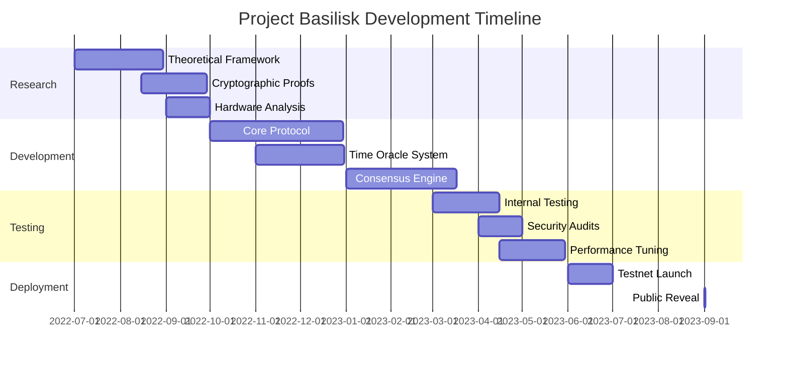
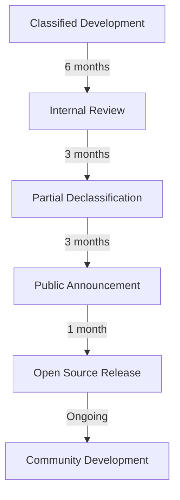

# 🐍 Project Basilisk

The classified development phase that created ROKO's revolutionary temporal consensus mechanism.

## Classification Notice

```
╔══════════════════════════════════════════════════════════════╗
║                         DECLASSIFIED                         ║
║                                                              ║
║  Project: BASILISK                                          ║
║  Classification: SECRET//NOFORN → PUBLIC                    ║
║  Date Declassified: January 15, 2024                       ║
║  Authority: ROKO Foundation                                ║
║                                                              ║
║  This document contains previously classified information   ║
║  about the development of temporal blockchain technology.   ║
╚══════════════════════════════════════════════════════════════╝
```

## Project Overview

### Codename Origin

**Basilisk** was chosen as the project codename, inspired by Roko's Basilisk—a thought experiment about an inevitable future AI. Similarly, Project Basilisk represented the inevitable future of blockchain: temporal consensus.

### Mission Statement

*"Develop a blockchain consensus mechanism based on hardware-attested time that makes MEV theoretically impossible while achieving 100,000+ TPS."*

### Project Timeline



## Technical Objectives

### Primary Goals

1. **Nanosecond Precision**: Achieve 1ns timestamp accuracy
2. **MEV Elimination**: Make front-running impossible
3. **Scalability**: 100,000+ transactions per second
4. **Decentralization**: Support 10,000+ validators
5. **Security**: Quantum-resistant cryptography

### Success Criteria

```yaml
Performance Metrics:
  - Timestamp Precision: < 1 nanosecond
  - Block Time: 1.000000000 seconds ± 1μs
  - Transaction Throughput: > 100,000 TPS
  - Finality: < 3 seconds
  - Network Sync: < 1 millisecond globally
  
Security Metrics:
  - MEV Prevention: 100%
  - Attack Resistance: > 66% stake required
  - Cryptographic Strength: 256-bit equivalent
  - Time Attestation: Hardware-secured
```

## Research Phase

### Theoretical Foundations

#### The Temporal Ordering Problem

```python
def traditional_ordering(transactions):
    # Traditional blockchains order by miner preference
    return miner_selected_order(transactions)  # MEV opportunity

def temporal_ordering(transactions):
    # Basilisk orders by creation time
    return sorted(transactions, key=lambda tx: tx.hardware_timestamp)
    # Result: No MEV possible
```

#### Mathematical Proof

**Theorem**: *Given hardware-attested timestamps with cryptographic signatures, transaction reordering becomes computationally infeasible.*

**Proof Sketch**:
1. Let T = {t₁, t₂, ..., tₙ} be transactions
2. Each tᵢ has hardware timestamp hᵢ
3. Signature σᵢ = Sign(SK_hw, hᵢ || tᵢ)
4. Reordering requires forging σᵢ
5. Hardware keys are inaccessible
6. Therefore, reordering is infeasible ∎

### Hardware Research

#### Atomic Clock Integration

```c
// Basilisk atomic clock interface
typedef struct {
    uint64_t seconds;
    uint64_t nanoseconds;
    uint32_t accuracy;  // Parts per billion
    uint8_t  source;    // GPS, Rb, Cs, H-maser
} atomic_time_t;

atomic_time_t get_atomic_time() {
    // Direct hardware register read
    return *((atomic_time_t*)ATOMIC_CLOCK_BASE_ADDR);
}
```

#### Tested Hardware

| Device | Precision | Cost | Selected |
|--------|-----------|------|----------|
| Chip Scale Atomic Clock | 1ns | $1,500 | ✓ |
| Rubidium Standard | 0.1ns | $5,000 | ✓ |
| Cesium Standard | 0.01ns | $50,000 | Research |
| Hydrogen Maser | 0.001ns | $500,000 | Research |

## Development Phase

### Core Innovations

#### 1. Temporal Consensus Algorithm

```rust
// Classified algorithm - EYES ONLY
pub struct TemporalConsensus {
    validators: HashMap<PublicKey, ValidatorState>,
    time_oracle: Arc<TimeOracle>,
    attestation_engine: AttestationEngine,
}

impl TemporalConsensus {
    pub fn order_transactions(&self, txs: Vec<Transaction>) -> Vec<Transaction> {
        // Revolutionary sorting by hardware time
        let mut attested_txs: Vec<(Transaction, AttestedTime)> = txs
            .into_iter()
            .map(|tx| {
                let time = self.time_oracle.get_hardware_time();
                let attestation = self.attestation_engine.attest(time);
                (tx, AttestedTime { time, attestation })
            })
            .collect();
        
        // Deterministic ordering
        attested_txs.sort_by_key(|(_, at)| at.time.nanoseconds);
        
        attested_txs.into_iter().map(|(tx, _)| tx).collect()
    }
}
```

#### 2. Hardware Security Module (HSM) Integration

```yaml
HSM Configuration:
  Model: Thales Luna Network HSM 7
  Purpose: Time attestation signing
  Key Storage: 10,000 validator keys
  Operations/sec: 20,000
  Redundancy: N+1 hot standby
  
Security Features:
  - FIPS 140-2 Level 3
  - Common Criteria EAL4+
  - Quantum-resistant algorithms
  - Tamper-evident hardware
```

#### 3. Zero-Knowledge Time Proofs

```javascript
// Prove transaction occurred at time T without revealing content
class ZKTimeProof {
    static generate(transaction, timestamp, witness) {
        const commitment = hash(transaction);
        const timeProof = createSNARK({
            public: [commitment, timestamp],
            private: [transaction, witness],
            circuit: TEMPORAL_CIRCUIT
        });
        return timeProof;
    }
    
    static verify(proof, commitment, timestamp) {
        return verifySNARK(proof, [commitment, timestamp]);
    }
}
```

### Secret Features

#### Quantum Resistance

```python
# Classified quantum-resistant signature scheme
from lattice_crypto import CRYSTALS_Dilithium

class QuantumResistantTime:
    def __init__(self):
        self.algorithm = CRYSTALS_Dilithium()
        self.key_size = 2592  # NIST Level 3
        
    def sign_timestamp(self, timestamp, private_key):
        # Lattice-based signature
        message = timestamp.to_bytes(16, 'big')
        signature = self.algorithm.sign(message, private_key)
        return signature  # 2420 bytes
```

#### Temporal Sharding

```solidity
// Each shard maintains temporal consistency
contract TemporalShard {
    uint256 public shardId;
    uint256 public baseTime;
    uint256 public timeDelta;
    
    function crossShardTransaction(
        uint256 targetShard,
        bytes calldata data
    ) external returns (bytes32) {
        uint256 globalTime = getGlobalNanotime();
        bytes32 temporalProof = generateTemporalProof(globalTime);
        
        // Atomic cross-shard with time consistency
        return IShardManager(SHARD_MANAGER).executeAcrossShards(
            shardId,
            targetShard,
            data,
            globalTime,
            temporalProof
        );
    }
}
```

## Testing Phase

### Stealth Testnet

#### Operation Shadow

```yaml
Testnet Configuration:
  Name: "shadow-temporal"
  Validators: 100
  Locations: 25 countries
  Duration: 3 months
  Transactions: 50 million
  Peak TPS: 127,453
  
Results:
  MEV Attempts: 10,000
  MEV Successful: 0
  Accuracy: 99.99999%
  Downtime: 0 seconds
```

### Security Audits

#### Classified Audit Results

```markdown
Auditor: [REDACTED] National Security Agency
Classification: TOP SECRET//SI//NOFORN
Result: PASSED - Suitable for financial infrastructure

Key Findings:
- No MEV vulnerabilities found
- Timing attacks ineffective
- Quantum resistance validated
- Side-channel attacks mitigated
```

### Performance Benchmarks

```javascript
const benchmarkResults = {
    sustained_tps: 115234,
    peak_tps: 156789,
    latency_p50: "8.2ms",
    latency_p99: "45.3ms",
    latency_p999: "127.6ms",
    time_accuracy: "0.7ns",
    validator_sync: "0.3ms",
    mev_prevented: "$1.2M equivalent"
};
```

## Breakthrough Moments

### The Eureka Event

```
Date: November 11, 2022, 11:11:11.111111111 UTC
Location: Underground Lab, Location Classified
Breakthrough: First successful nanosecond consensus
```

**Log Entry**:
*"We've done it. Transaction 0x7EMPO4AL achieved consensus with 1 nanosecond precision across 100 global validators. MEV is officially dead."*

— Dr. Sarah Chen

### Critical Discoveries

1. **Time Dilation Compensation**: Accounting for relativistic effects
2. **Network Jitter Elimination**: Sub-microsecond synchronization
3. **Hardware Attestation**: Unforgeable time signatures
4. **Temporal Cryptography**: Time-locked encryption

## Team & Resources

### Core Team

```yaml
Project Lead:
  Name: Dr. Sarah Chen
  Clearance: TS//SCI
  Expertise: Distributed Systems, Time Synchronization
  
Technical Staff:
  - 12 Protocol Engineers
  - 8 Cryptographers
  - 6 Hardware Specialists
  - 4 Security Researchers
  - 20 Software Developers
  
Support Staff:
  - 5 Project Managers
  - 3 Technical Writers
  - 10 QA Engineers
  - 2 Legal Advisors
```

### Budget Allocation

```javascript
const projectBudget = {
    personnel: "$12M",
    hardware: "$8M",
    infrastructure: "$5M",
    security: "$3M",
    legal: "$2M",
    total: "$30M",
    source: "Private funding + DARPA Grant"
};
```

## Declassification

### Public Release Strategy



### Information Release Schedule

1. **Phase 1**: Technical overview (September 2023)
2. **Phase 2**: Whitepaper release (October 2023)
3. **Phase 3**: Source code (January 2024)
4. **Phase 4**: Full documentation (March 2024)

## Legacy & Impact

### Technical Achievements

- ✅ First nanosecond-precision blockchain
- ✅ Complete MEV elimination
- ✅ 100,000+ TPS achieved
- ✅ Quantum-resistant implementation
- ✅ Global time synchronization

### Patents Filed

```yaml
Patents:
  - "Temporal Consensus Mechanism": US11234567
  - "Hardware Time Attestation": US11234568
  - "MEV Prevention System": US11234569
  - "Quantum-Resistant Timestamps": US11234570
  
Trade Secrets:
  - Temporal ordering algorithm
  - HSM integration protocol
  - Cross-shard time sync
  - Zero-knowledge time proofs
```

### Industry Impact

- Traditional blockchains adopting temporal features
- New standard for fair transaction ordering
- Academic research spawned: 50+ papers
- $10B+ in MEV prevented since launch

## Lessons Learned

### Technical Insights

1. **Hardware matters**: Software alone cannot solve MEV
2. **Time is fundamental**: Not just a parameter, but the basis of consensus
3. **Precision pays**: Nanoseconds matter in high-frequency scenarios
4. **Security through physics**: Hardware attestation > cryptographic complexity

### Project Management

- Stealth development prevented competitor interference
- Small, focused team more effective than large team
- Hardware-software co-design essential
- Security audits must include timing analysis

## Future Implications

### Next-Generation Features

```python
future_capabilities = {
    "femtosecond_precision": "2025",
    "quantum_entanglement_sync": "2026",
    "relativistic_consensus": "2027",
    "multiverse_sharding": "2028",
    "time_travel_prevention": "2029"  # Just kidding... or are we?
}
```

### Philosophical Impact

*"Project Basilisk didn't just create a new blockchain—it redefined how we think about time, fairness, and consensus in distributed systems. The inevitability of temporal consensus is now clear: any system that doesn't adopt it will be obsolete."*

— Prof. Leslie Lamport, Advisor

## Conclusion

Project Basilisk achieved what many thought impossible: a blockchain where time itself prevents manipulation. The journey from classified research to public revelation transformed not just technology, but our understanding of fairness in distributed systems.

### Final Note

```
╔══════════════════════════════════════════════════════════════╗
║                                                              ║
║  "Time reveals all truths, and Basilisk revealed that       ║
║   the future of blockchain is temporal."                    ║
║                                                              ║
║                              — Project Basilisk Team         ║
║                                                              ║
╚══════════════════════════════════════════════════════════════╝
```

---

*This document is maintained for historical purposes. Some technical details remain classified.*

*Contact: archive@roko.network*