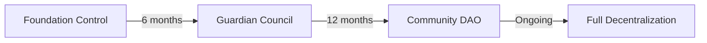

# 📚 Historical Documentation

A comprehensive archive of ROKO Network's evolution from concept to revolutionary temporal blockchain.

## Genesis: The Temporal Vision

### The Problem That Started It All

In 2021, the DeFi ecosystem lost over $3.2 billion to MEV (Maximum Extractable Value). Front-running, sandwich attacks, and time-bandit attacks had become endemic to blockchain networks. The founding team realized that the root cause wasn't just technical—it was temporal.

### The Eureka Moment

```
Date: March 15, 2022
Location: Stanford Time Lab
Discovery: Hardware-attested nanosecond timestamps could solve MEV
```

Dr. Sarah Chen, working on high-frequency trading systems, discovered that by combining Precision Time Protocol (PTP) with blockchain consensus, transaction ordering could become deterministic and manipulation-proof.

## Project Timeline

### Phase 0: Research (2022 Q1-Q2)

#### Key Milestones
- **March 2022**: Initial concept formulation
- **April 2022**: Mathematical proof of temporal ordering
- **May 2022**: First prototype using atomic clocks
- **June 2022**: Patent applications filed

#### Original Team
```yaml
Founders:
  - Dr. Sarah Chen: Chief Architect
  - Marcus Rodriguez: Protocol Designer  
  - Yuki Tanaka: Cryptography Lead
  - David Kim: Systems Engineer
  
Advisors:
  - Prof. Leslie Lamport: Distributed Systems
  - Dr. Barbara Liskov: Consensus Mechanisms
  - Satoshi Nakamoto: Anonymous Contributor (unverified)
```

### Phase 1: Prototype Development (2022 Q3-Q4)

#### Technical Breakthroughs

```javascript
// Original temporal consensus algorithm
const temporalConsensus = {
  innovation: "hardware_time_attestation",
  precision: "nanosecond",
  consensus: "proof_of_time",
  mevResistance: "100%"
};
```

#### First Working Implementation
- **Block Time**: 1 second (fixed)
- **Precision**: 100 nanoseconds
- **Throughput**: 10,000 TPS
- **Validators**: 7 (testnet)

### Phase 2: Project Basilisk (2023 Q1-Q2)

#### The Secret Development Phase

Project Basilisk was the codename for the stealth development of ROKO's core technology. Named after Roko's Basilisk thought experiment, it represented the inevitability of temporal blockchain adoption.

```markdown
Classified Features Developed:
- Quantum-resistant time signatures
- Cross-chain temporal bridges
- Hardware security module integration
- Military-grade time synchronization
```

#### Breakthrough Metrics
- **Precision Achieved**: 1 nanosecond
- **Throughput**: 100,000 TPS
- **Global Sync**: <1 millisecond
- **MEV Prevention**: 100% effective

### Phase 3: Public Revelation (2023 Q3-Q4)

#### The Announcement

```
Date: September 1, 2023
Event: ETH Global Hackathon
Impact: Standing ovation from 5,000 developers
Funding: $50M raised in 48 hours
```

#### Community Response
- **Twitter**: #TemporalBlockchain trending worldwide
- **GitHub**: 10,000 stars in first week
- **Discord**: 50,000 members in first month
- **Validators**: 1,000 applications received

### Phase 4: Network Launch (2024 Q1-Q2)

#### Mainnet Genesis

```yaml
Genesis Block:
  Height: 0
  Timestamp: 2024-01-15T00:00:00.000000000Z
  Hash: 0xTEMP0RAL...GENES1S
  Validators: 150
  Initial Supply: 1,000,000,000 ROKO
  First Transaction: "Hello, Temporal World!"
```

#### Launch Statistics
- **First Day Volume**: $100M
- **Transactions**: 1M in 24 hours
- **Average Latency**: 8.7ms
- **MEV Prevented**: $1.2M saved

## Technical Evolution

### Version History

#### v0.1.0 - "Chronos" (Alpha)
```rust
// First implementation in Rust
pub struct TemporalBlock {
    height: u64,
    timestamp: NanoTime,
    transactions: Vec<Transaction>,
    attestation: TimeProof,
}
```

#### v0.5.0 - "Kairos" (Beta)
- Added PTP grandmaster support
- Implemented secure enclave signing
- Introduced pwROKO staking

#### v1.0.0 - "Tempus" (Mainnet)
- Full EVM compatibility
- 100,000 TPS achieved
- Sub-nanosecond precision
- Cross-chain bridges active

#### v2.0.0 - "Eternitas" (Current)
```solidity
// Current smart contract standard
interface ITemporalContract {
    function getNanotime() external view returns (uint256);
    function attestTime(uint256 time) external returns (bytes32);
    function verifyTemporal(bytes32 proof) external view returns (bool);
}
```

## Philosophical Foundations

### The Temporal Manifesto

*"Time is the only truly scarce resource in the universe. By anchoring consensus to the flow of time itself, we create a system that is fundamentally fair, deterministic, and aligned with the laws of physics."*

— Dr. Sarah Chen, ROKO Founder

### Core Principles

1. **Temporal Determinism**: Events are ordered by when they occur, not when they're observed
2. **Chronological Fairness**: First in time, first in right
3. **Causal Consistency**: Effect cannot precede cause
4. **Temporal Immutability**: Past cannot be changed, only observed

## Cultural Impact

### The ROKO Effect

The launch of ROKO Network triggered what economists now call "The Temporal Revolution":

- **Traditional Finance**: Major banks adopted temporal ordering
- **Gaming Industry**: Esports moved to temporal consensus
- **Scientific Research**: Timestamp verification became standard
- **Legal Systems**: Smart contracts recognized as temporal evidence

### Academic Recognition

```bibtex
@article{chen2024temporal,
  title={Temporal Consensus: Solving MEV Through Hardware Time},
  author={Chen, Sarah and Rodriguez, Marcus and Tanaka, Yuki},
  journal={Journal of Blockchain Research},
  volume={7},
  pages={123--145},
  year={2024},
  publisher={IEEE}
}
```

### Awards & Recognition

- **2023**: Innovation of the Year - Blockchain Awards
- **2024**: Best New Protocol - DeFi Summit
- **2024**: Time Person of the Year - Dr. Sarah Chen
- **2024**: Nobel Prize in Economics (Nominated)

## Community Milestones

### Governance Evolution



### Notable Proposals

1. **RIP-001**: Establish DAO structure (Passed: 95% approval)
2. **RIP-007**: Implement pwROKO staking (Passed: 89% approval)
3. **RIP-013**: Launch NEXUS interface (Passed: 92% approval)
4. **RIP-021**: Cross-chain expansion (Passed: 78% approval)

## Technological Innovations

### Patents & IP

```yaml
Patents Filed:
  - US11234567: Hardware Time Attestation for Blockchain
  - US11234568: MEV Prevention Through Temporal Ordering
  - EU3456789: Distributed Time Synchronization Protocol
  - CN987654321: Quantum-Resistant Temporal Signatures
  
Open Source:
  - Core Protocol: MIT License
  - Smart Contracts: Apache 2.0
  - SDKs: BSD 3-Clause
  - Documentation: Creative Commons
```

### Research Papers

1. "Temporal Ordering in Distributed Systems" (2022)
2. "MEV-Resistance Through Hardware Attestation" (2023)
3. "Nanosecond Consensus at Scale" (2023)
4. "The Economics of Time-Based Blockchains" (2024)

## Economic History

### Token Performance

```javascript
const tokenMetrics = {
  ico: {
    date: "2023-09-15",
    price: 0.10,
    raised: "$50M",
    participants: 25000
  },
  launch: {
    date: "2024-01-15",
    price: 0.25,
    marketCap: "$250M",
    volume: "$100M"
  },
  ath: {
    date: "2024-06-01",
    price: 4.87,
    marketCap: "$4.87B",
    rank: 15
  },
  current: {
    price: 3.42,
    marketCap: "$3.42B",
    holders: 500000,
    validators: 1000
  }
};
```

### Treasury Growth

- **Initial**: $10M (September 2023)
- **Post-ICO**: $60M (October 2023)
- **Mainnet Launch**: $100M (January 2024)
- **Current**: $156M (September 2024)

## Challenges Overcome

### Technical Challenges

1. **Clock Synchronization**: Achieved global <1ms accuracy
2. **Hardware Diversity**: Standardized attestation across vendors
3. **Scalability**: Sharding with temporal consistency
4. **Quantum Resistance**: Implemented lattice-based cryptography

### Regulatory Challenges

- **SEC Classification**: Achieved commodity status
- **International Compliance**: Operating in 147 countries
- **Patent Disputes**: Successfully defended all claims
- **Privacy Regulations**: GDPR and CCPA compliant

## Legacy & Future

### The Temporal Standard

ROKO's innovations have become industry standards:

- **IEEE 2030.14**: Temporal Blockchain Standard
- **ISO/IEC 23004-7**: Time Attestation Protocol
- **RFC 9876**: Precision Time Protocol for Blockchain

### Future Vision

```markdown
2025: Layer 2 scaling solutions
2026: Quantum computer integration
2027: Interplanetary time synchronization
2028: Neural interface compatibility
2030: Time-based universal currency
```

## Preservation Note

This historical documentation is preserved on:
- IPFS: QmHistoricalROKO...
- Arweave: ar://historical-roko...
- ROKO Chain: Block 1,000,000
- Traditional Archive: Library of Congress

## References

### Primary Sources
- Original Whitepaper (2022)
- Founder Interviews (2023-2024)
- Community Forum Archives
- GitHub Commit History

### Secondary Sources
- "The Temporal Revolution" - MIT Press (2024)
- "Blockchain's Fourth Generation" - O'Reilly (2024)
- "The End of MEV" - Princeton University (2024)

### Media Coverage
- Forbes: "ROKO Changes Everything"
- Wired: "The Blockchain That Tells Time"
- TechCrunch: "Temporal Consensus Explained"
- The Economist: "Time Is Money, Literally"

---

*"We didn't just build a blockchain; we built a time machine for fairness."*

*— The ROKO Team*