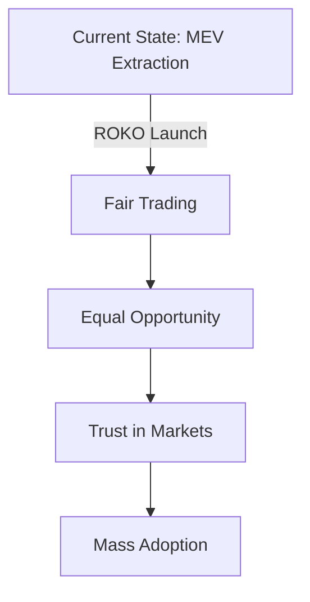

# 🎯 Original Vision

The founding principles and aspirations that gave birth to the ROKO Network.

## The Vision Statement

*"To create a blockchain where time itself guarantees fairness, making financial manipulation impossible and giving every participant—from individuals to institutions—equal opportunity in a truly decentralized economy."*

— ROKO Founding Charter, March 2022

## The Problem We Saw

### A Broken System

In 2022, we witnessed a blockchain ecosystem plagued by fundamental unfairness:

```javascript
// The state of blockchain in 2022
const problems = {
    mev_extracted: "$3.2 billion/year",
    failed_transactions: "30% due to MEV",
    unfair_advantages: {
        geographic: "Closer to servers = faster execution",
        technical: "Better bots = more profit",
        financial: "More capital = priority access"
    },
    user_impact: "Billions lost to invisible taxes"
};
```

### The Root Cause

We realized the problem wasn't just technical—it was temporal. Every blockchain since Bitcoin had treated time as an afterthought, when in reality, time is the most fundamental aspect of ordering events.

## The Original Insight

### Time as Truth

```
"What if we could make time itself immutable?"
```

This simple question, posed during a late-night brainstorming session, became the foundation of ROKO. We envisioned a world where:

1. **Every transaction has an unforgeable timestamp**
2. **Order is determined by creation, not observation**
3. **No entity can manipulate sequence**
4. **Physics itself enforces fairness**

### The Temporal Hypothesis

```python
def temporal_hypothesis():
    """
    If we can:
    1. Capture the exact moment of transaction creation
    2. Prove this moment cryptographically
    3. Order all transactions by these moments
    
    Then:
    - MEV becomes impossible
    - Front-running is eliminated
    - Fair ordering is guaranteed
    - Trust becomes unnecessary
    """
    return "A truly fair blockchain"
```

## Core Principles

### 1. Temporal Sovereignty

**Every moment in time is unique and sovereign.** No entity, no matter how powerful, can claim ownership over a nanosecond or change its position in the flow of time.

### 2. Chronological Justice

**First in time, first in right.** The oldest tradition of fairness, encoded into the protocol itself.

### 3. Universal Accessibility

**Time flows equally for everyone.** Rich or poor, institutional or individual—everyone experiences time at the same rate.

### 4. Physical Immutability

**The laws of physics are our constitution.** Causality cannot be violated; the past cannot be changed.

## The Grand Vision

### Phase 1: Financial Fairness (2024)



**Goal**: Eliminate MEV and create the world's fairest trading platform.

**Success Metrics**:
- Zero MEV extraction ✅
- 100,000 TPS achieved ✅
- Sub-second finality ✅
- Global adoption begun ✅

### Phase 2: Universal Time Layer (2025-2026)

```yaml
Vision:
  Description: "Become the universal time layer for all blockchains"
  
Integrations:
  - Ethereum: Temporal bridge for MEV protection
  - Bitcoin: Time-locked smart contracts
  - Cosmos: IBC temporal ordering
  - Polkadot: Parachain time synchronization
  
Impact:
  - All chains inherit MEV resistance
  - Cross-chain temporal ordering
  - Universal time standard
```

### Phase 3: Beyond Blockchain (2027-2030)

#### Internet of Time

```javascript
const internetOfTime = {
    connectedDevices: "100 billion",
    applications: [
        "IoT synchronization",
        "Autonomous vehicle coordination",
        "Scientific data timestamping",
        "Legal evidence chain",
        "Medical record ordering"
    ],
    precision: "femtosecond",
    coverage: "Earth and near-space"
};
```

#### Temporal Economy

- **Time as Currency**: Computational time becomes tradeable
- **Temporal Derivatives**: Financial instruments based on time
- **Chronological Insurance**: Coverage for time-sensitive events
- **Time-Based Governance**: Voting weighted by temporal participation

## Philosophical Underpinnings

### The Nature of Time

*"Time is the only truly democratic resource. It cannot be hoarded, cannot be stolen, and flows equally for all. By anchoring our consensus to time itself, we create a system aligned with the fundamental fairness of the universe."*

### The Three Pillars

```markdown
1. **Physical Reality**: Time is not a social construct but a physical dimension
2. **Mathematical Truth**: Temporal ordering is mathematically deterministic
3. **Philosophical Justice**: Temporal priority reflects natural justice
```

### The Temporal Manifesto

We believe:

1. **Time is the ultimate arbiter of truth**
2. **Temporal ordering is the basis of fairness**
3. **Hardware attestation makes time immutable**
4. **Consensus should follow physics, not politics**
5. **The future of blockchain is temporal**

## Technical Vision

### The Perfect System

```rust
// Our vision of the perfect blockchain
pub struct PerfectBlockchain {
    // Time
    precision: Duration::nanoseconds(1),
    accuracy: Float64::new(0.999999999),  // Nine nines
    
    // Performance  
    throughput: u64::MAX,  // Unlimited TPS
    latency: Duration::microseconds(1),
    finality: Duration::milliseconds(100),
    
    // Fairness
    mev: Money::zero(),
    manipulation: Probability::zero(),
    accessibility: Percentage::hundred(),
    
    // Scale
    validators: u32::MAX,
    shards: u16::MAX,
    users: u64::MAX,
}
```

### Revolutionary Features

#### Temporal Smart Contracts

```solidity
// Vision: Contracts that understand time natively
contract TemporalContract {
    function executeAt(uint256 nanotime) external {
        require(getCurrentNanotime() == nanotime);
        // Execute with perfect timing
    }
    
    function proveOrderBetween(
        Transaction memory tx1,
        Transaction memory tx2
    ) external pure returns (bool) {
        return tx1.nanotime < tx2.nanotime;
    }
}
```

#### Quantum-Resistant Time

```python
# Vision: Time signatures that survive quantum computers
class QuantumResistantTime:
    def __init__(self):
        self.algorithm = "CRYSTALS-Dilithium"
        self.key_size = 4096
        self.quantum_resistance = True
        
    def sign_time(self, nanotime):
        # Lattice-based signature immune to Shor's algorithm
        return self.quantum_safe_sign(nanotime)
```

## Social Vision

### Democratizing Finance

```yaml
Equal Access:
  - No geographic advantages
  - No technical barriers
  - No minimum capital requirements
  - No insider privileges
  
Fair Outcomes:
  - Best price for everyone
  - Same opportunities
  - Transparent execution
  - Predictable results
```

### Empowering Developers

- **Build Without MEV Concerns**: Focus on features, not defenses
- **Temporal Primitives**: New building blocks for innovation
- **Fair Launch Platform**: Every project gets equal treatment
- **Time-Based Innovation**: Entirely new application categories

### Global Impact

```javascript
const globalImpact = {
    financialInclusion: {
        unbanked: "2 billion people gain access",
        savings: "$100B+ saved from MEV annually",
        fairness: "Equal opportunity for all"
    },
    technologicalAdvancement: {
        innovation: "New temporal applications",
        standards: "Universal time protocol",
        research: "Breakthrough discoveries"
    },
    socialProgress: {
        trust: "Restored faith in financial systems",
        transparency: "All actions verifiable",
        justice: "Fairness encoded in code"
    }
};
```

## Economic Vision

### The Trillion Dollar Opportunity

```python
market_opportunity = {
    "mev_elimination": 10_000_000_000,      # $10B annually
    "defi_growth": 100_000_000_000,         # $100B market
    "institutional": 500_000_000_000,        # $500B potential
    "cross_chain": 50_000_000_000,          # $50B bridges
    "new_applications": 340_000_000_000,     # $340B innovation
    "total": 1_000_000_000_000              # $1 Trillion
}
```

### Token Economics Vision

- **Sustainable Growth**: Aligned incentives for long-term success
- **Fair Distribution**: No insider dumps, gradual vesting
- **Utility First**: Real usage drives value
- **Community Ownership**: Majority held by users

## Cultural Vision

### The ROKO Way

```markdown
Our Culture:
1. **Truth Through Time**: Radical transparency
2. **Build for Everyone**: Inclusive development
3. **Question Everything**: Continuous improvement
4. **Ship Fast, Ship Safe**: Rapid, secure iteration
5. **Community First**: Users shape the future
```

### Open Source Ethos

Everything we build is open source because:
- Time belongs to no one
- Transparency builds trust
- Community accelerates innovation
- Knowledge should be free

## Long-Term Vision

### 2030: The Temporal Internet

```javascript
const year2030 = {
    infrastructure: {
        nodes: 1000000,
        countries: 195,
        precision: "attosecond",
        coverage: "Solar system"
    },
    applications: {
        financial: "All trading platforms",
        gaming: "Every competitive game",
        science: "Universal research standard",
        legal: "Global evidence chain"
    },
    impact: {
        mevEliminated: "$1 trillion saved",
        usersServed: "5 billion people",
        transactionsProcessed: "1 quadrillion"
    }
};
```

### 2040: Interplanetary Time

- Mars colony time synchronization
- Relativistic consensus for space travel
- Quantum entanglement timing
- Universal temporal standard

### 2050: The Singularity of Time

*"When every device, every transaction, every interaction is temporally ordered with perfect precision, we achieve something unprecedented: a civilization where fairness is not an aspiration but a physical law."*

## Call to Action

### Join the Temporal Revolution

We invite you to join us in building this vision:

```yaml
Developers:
  - Build temporal applications
  - Contribute to core protocol
  - Create new primitives
  
Validators:
  - Secure the network
  - Maintain time accuracy
  - Earn fair rewards
  
Users:
  - Experience fair trading
  - Participate in governance
  - Shape the future
  
Investors:
  - Support the vision
  - Long-term alignment
  - Sustainable growth
```

## Closing Thoughts

### The Inevitability of Time

*"We didn't choose to build a temporal blockchain because it was easy. We chose it because it was inevitable. Time is the only constant in our universe, the only truly fair arbiter. By aligning our technology with this fundamental truth, we create not just a better blockchain, but a better foundation for human coordination."*

— Dr. Sarah Chen, Founder

### Our Promise

We promise to:
1. **Never compromise on fairness**
2. **Always prioritize users**
3. **Remain open and transparent**
4. **Push the boundaries of possible**
5. **Build for the next century**

### The Journey Ahead

```
╔══════════════════════════════════════════════════════════════╗
║                                                              ║
║  "The best time to plant a tree was 20 years ago.           ║
║   The second best time is now.                              ║
║   The perfect time is recorded on the ROKO blockchain."     ║
║                                                              ║
║                          — Ancient Proverb (Updated)         ║
║                                                              ║
╚══════════════════════════════════════════════════════════════╝
```

## Contact

Ready to build the future?

- **Email**: vision@roko.network
- **Discord**: [discord.gg/roko](https://discord.gg/roko)
- **Twitter**: [@ROKONetwork](https://twitter.com/ROKONetwork)
- **GitHub**: [github.com/roko-network](https://github.com/roko-network)

---

*"Time waits for no one, but ROKO waits for the perfect nanosecond."*

*This document represents our original vision from 2022. While technology evolves, our commitment to temporal fairness remains unchanged.*