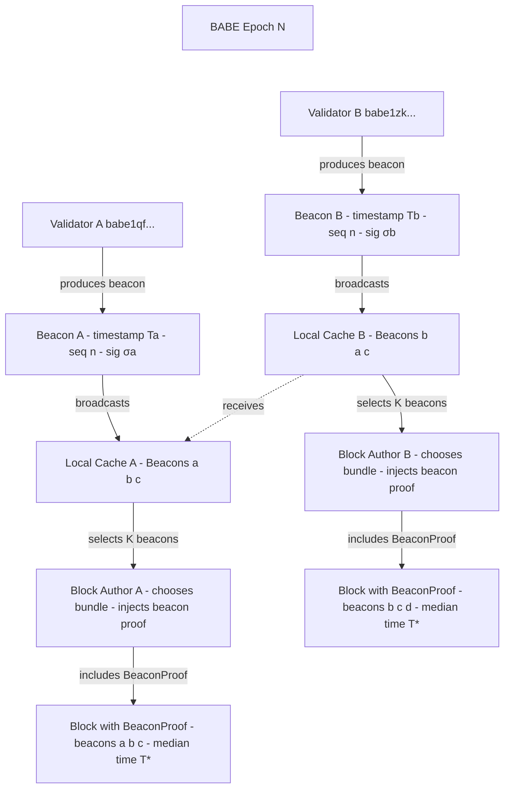

## Roko Network – Of Time and Stamps

### Solving for Time

The primary motivation of our team has always been to bring **time as a first-class feature** of a blockchain – our blockchain, the Roko L1.

With a Time Card in our hands (an expensive piece of hardware), I still remember us looking at the flow of transactions on Polkadot and Ethereum, all featuring this `block.timestamp` or `now` and wondering what “now” really meant. What was *now*?

Temporality is crucial for DeFi, yet any smart contract using `now` will typically compile with a warning. `now` is unreliable. **But why?**

> When a node creates (mines or validates) a block:
>
> - The node checks its local system clock.
> - It sets the block’s timestamp field to that time (possibly rounded or slightly adjusted).
> - It signs and broadcasts the block to the network.
> - Other nodes verify the block, and part of that verification includes checking the timestamp constraints.

**Alright, have a look at what the constraints are.**

> Consensus Rules Around Block Timestamps
>
> Each blockchain has its own precise rules, but most follow similar principles:
>
> A. Must Be Greater Than the Previous Block’s Timestamp  
> This ensures time always moves forward.  
> `block.timestamp > parent.timestamp`
>
> B. Cannot Be Too Far in the Future  
> This prevents miners/validators from setting fake future times to gain advantage (for example, manipulating rewards, timestamps, or smart contract logic).
>
> `block.timestamp < now() + MAX_FUTURE_OFFSET`
>
> The maximum allowed offset varies by network:
>
> - Bitcoin: cannot be more than 2 hours ahead of the median network time.
> - Ethereum: cannot be greater than 15 seconds ahead of the local node’s time (in Proof of Stake).
> - Polkadot/Substrate (like Bittensor): typically within a block‑duration tolerance window (usually a few seconds).

**Alright, so that’s loose enough, and the warning makes sense.**

> That warning when you use `block.timestamp` — it’s a security warning.
>
> Let’s unpack exactly why Solidity warns you, what it means, and when it’s safe to use anyway.
>
> ⚠️ Why Solidity Warns About `block.timestamp`
>
> The short version:
>
> `block.timestamp` can be influenced — slightly — by miners or validators.  
> It’s not an exact or trustworthy source of time, and in certain contexts (like time‑based logic in smart contracts), that small leeway can be exploited.

**And there we go.**

We saw many exploits of the timestamp. One of the classic ones is a miner with the ability to trigger a transaction a bit earlier and front‑run everyone else.

And now we’re back to the Time Card. It’s a neat piece of hardware, right? But if we look at the software behind it, we discover that time compliance is a thing, syncing protocols are a thing, time *servers* are a thing.

So if it were possible to bring time compliance to blockchain, couldn’t we just have a better `now` for everyone? **What else can we do with time?**

### Waste of Time

Our first idea was to find a way to sign time cryptographically. We have a Time Card, we have an HSCM device; surely there must be a way for the block producer to prove their timestamp is correct?

We spent quite some time looking for a way to have a cryptographical “proof of time” that could just be added to the block header and be done with it. Slap the hardware on a validator and you’re good to go. **Yet…**

While the concept of “time consensus” exists outside of blockchain, you can’t prove time, but you can attest to it. And to attest to time, you need witnesses.

So how about a miner that hashes the block and publishes it so that others can attest to the time of production? Here is where the limitations of consensus speed, block and transaction throughput come into play. Having to collect attestations for your block takes… time, and it largely pushes the problem further ahead without really solving it.

We’d be happy to share more of our research on the matter and the iterations and R&D we went through, but let’s skip to the solution.

### A Miner out of Time

Remove the timestamping from the miner. Yes: they can’t lie if they’re not the one writing it. But then who? Who can we trust? **Who has the right time and wouldn’t lie about it?**

No one, individually. But we have BFT. Let’s piggyback on that. BFT can be proven.

### Time Beacons

Roko technology, built on Substrate, adds a new task for validators: producing **time beacons**. By configuring this specific pallet, it is possible to force all validators to emit time beacons and apply penalties to out‑of‑sync actors. It is also possible to configure a subset of validators to provide the time beacons to the network as a bootstrapping phase until greater adoption of the required hardware, or simply to rely on in‑house (but auditable) validators with time capabilities to support your network.

What the validators then start producing looks like this:

```json
{
  "validatorId": "babe1qf...2k7h",
  "timestampUs": 1730123456789000,
  "sequence": 42,
  "signature": "0x8afc1c2d4e...dbe1",
  "epochRandomness": "0xb6f0c67a91...a0ff"
}
```

Those timestamps are shared with the whole network and signed by the validator. Beacon frequency can be configured. For Roko Network we’re aiming at 150 ms at launch.

Now you have your network inundated by this chatter, but you don’t want it to clog your chain, right?

While the networking load can’t be reduced as of now, storage won’t suffer much from this because beacons actually live in the runtime. Basically they are temporary. They will only be stored when added to a block or mentioned in a slashing transaction.

### Proof of Time

Now we have those beacons ready for collecting, but how do we use them? Do we need a new consensus mechanism? Well, yes and no. Our system is designed to work with BABE/GRANDPA and likely most other consensus stacks. However, extra block‑validity verification rules are possible with Substrate, so integration is not tricky.

The whole idea is that when we produce a block, the timestamp written in it must be **proven**. Thanks to the beacons we no longer need after‑the‑fact attestations; we have something else: the time consensus that is currently happening as we produce the block.



So there you go, a simplified example of what’s happening during block production.

In simpler terms, the block producer collects beacon proofs and must keep a fresh cache of recent beacons. As they are assigned block production, they must prove the time of production by adding a selection (usually K of N) beacons (storage and proof are being optimized so we don’t end up with huge blocks) and then have their timestamp match the median timestamp of those beacons.

We end up with a block that looks somewhat like this:

```box:Block #12,345
Parent Hash:      0x4fd8…8c2a
Author:           babe1qf…2k7h
State Root:       0xa7b1…932e
Extrinsics Root:  0x33aa…fe45

─── Time Beacon Proof ───────────────────────────────────────────────────────

Claimed Block Time:   2024-09-28 10:17:36.789 UTC
Spread max-min:       42 ms
Median canonical:     2024-09-28 10:17:36.791 UTC

┌─────────────┬──────────────────┬────────────────────┬──────────┬────────────────┐
│ Beacon      │ Validator        │ Timestamp (µs)     │ Sequence │ Signature      │
├─────────────┼──────────────────┼────────────────────┼──────────┼────────────────┤
│ Beacon 1    │ babe1qf…2k7h     │ 1730123456789000   │ 42       │ 0x8afc…dbe1    │
│ Beacon 2    │ babe1zk…xp4m     │ 1730123456798000   │ 105      │ 0xe4ab…9910    │
│ Beacon 3    │ babe1mv…hnt9     │ 1730123456776000   │ 88       │ 0x91cd…0f2b    │
└─────────────┴──────────────────┴────────────────────┴──────────┴────────────────┘
```

As the block is produced, there is an opportunity for slashing bad actors. As we collect fresh beacons, we detect if a validator failed to fall within the **tolerance window**. We can then simply include a slashing transaction with proof of drift. Slashing is not mandatory but exploratory at this stage. This leads us to the question of how time propagates in a network of nodes.

### Time Propagation

Blockchain relies on gossiping; controlling the communication patterns between nodes is extremely tricky. Transactions and blocks propagate in total chaos and now we’re adding time to the equation. Unfortunately, any kind of gossip messaging takes time to propagate and can reach its destination too late, resulting in a local loss of sync during validation. Network conditions change, and a chain must be able to adapt to this.

So let’s talk about **tolerance windows** and how we solve for gossiping inconsistency.

The current solution Roko offers is a drift tolerance that can be configured by the protocol owner or by votes. At launch, our chain will probably feature a 2‑second drift tolerance for beacons, so pretty similar to the windows of tolerance of most blockchains, but this parameter can be tightened as the number of beacons and networking quality increase. We expect that with a sufficient number of validators producing time beacons we could reasonably reach a drift of 500 ms, which would mean that at any given time, any block producer would have enough fresh beacons in memory to prove that their block was produced with a sub‑second margin of error.

### A User with Time

Finally, now that we’ve secured block timestamps and have all of those beacons firing, let’s talk about why we would bother with such a complex system.

After integrating the Beacons pallet (your validators produce time beacons), then the Temporal pallet (your blocks use beacons to compute provable timestamps), it is time to integrate the **Temporal Transaction** pallet, which we simply call “transaction type 3” from time to time.

The idea behind this new kind of transaction is to add a proof of signing time directly into the transaction header. **But why?**

### Temporal Transactions

Normal transactions compete for gas; temporal transactions compete for time. But first, we must find a way to prove the time of creation of a transaction in the same way we’re trying to prove the time of creation of a block. So we also have the wallet producing the transaction collecting those same beacons:

```box:Temporal Transaction
Address:   5G9v…XJwa
Calldata:  0x…
Nonce:     42

Temporal Metadata:
  beaconProofHash:    0xb377…f9aa
  medianTimestampUs:  1730123470123456  (≈ 2024-09-28 10:17:50.123Z)

Embedded Time Beacon Proof (K = 3):
  ┌──────────────────┬────────────────────┬─────────┬───────────┐
  │ Validator        │ Timestamp          │ Seq     │ Signature │
  ├──────────────────┼────────────────────┼─────────┼───────────┤
  │ babe1qf…2k7h     │ 1730123469123456   │ 43      │ σ₁        │
  │ babe1zk…xp4m     │ 1730123470456123   │ 106     │ σ₂        │
  │ babe1mv…hnt9     │ 1730123470812345   │ 89      │ σ₃        │
  └──────────────────┴────────────────────┴─────────┴───────────┘

Validation Flow:
  1. Check user signature + nonce as usual
  2. Re-verify each beacon signature (σᵢ) with epoch randomness
  3. Ensure beacon timestamps fall within allowed spread/deviation
  4. Confirm medianTimestampUs ≤ transaction deadline and ordering rules
```

Of course, storage of the time proof must be optimized; it’s not necessary to store the beacons in the transaction itself. But for testing purposes this is already an interesting setup.

What we’re looking at here is a transaction with a timestamp. The proof of this timestamp through beacons is still a topic of R&D on our side, as is the optimization of gas usage. Yet for the sake of argument, let’s say that reusing the same system as we did for the blocks would perform in a similar way, thus enabling timestamped transactions and allowing the chain to organize itself differently. We call this **temporal ordering**.

### Temporal Ordering

Imagine a system where all transactions are executed in the order in which they are signed by their users.

The existence of temporal transactions directly implies temporal ordering.

In a system like this, chain block height doesn’t matter and the order of execution is predetermined in real time as users interact with the chain. When a transaction reaches the mempool, the history is already written, just… not computed yet, and as the chain catches up, the final state will only confirm this.

As the tolerance window decreases, the exact time of signature starts to matter.

While provable time of signature and execution is a great feature for time‑attestation services, we’ll focus on the elephant in the room: MEV.

### MEV

Yes, MEV resistance has been the purpose all along.

What we have at this point is a way to prevent back‑dating, and thus no miner nor front‑runner can do anything about the order in which your transaction is executed. As the block producer works on their block, they are working on a block that is created *after* your timestamp and are not able to include a transaction before it. It’s as simple as that. Moreover, if an observer looks at the mempool to try to extract value by executing a transaction before you, they won’t be able to back‑date it either. Or at least, that’s what we’re trying to build here.

Essentially, temporal transactions can’t be front‑run, removing many attack vectors that classic chains suffer from.

### The Roko Network Template

```html
<table class="arch-diagram">
  <caption>ROKO NETWORK</caption>
  <tr>
    <td>
      <div class="component">
        <div class="component-title">Beacons</div>
        <div class="component-desc">Validator timing proofs entering each slot</div>
      </div>
    </td>
    <td>
      <div class="component">
        <div class="component-title">Time Blocks</div>
        <div class="component-desc">Ordered blocks stamped by beacon proofs</div>
      </div>
    </td>
    <td>
      <div class="component">
        <div class="component-title">Frontier</div>
        <div class="component-desc">EVM / API edge</div>
      </div>
    </td>
  </tr>
  <tr>
    <td colspan="3" class="full-width">
      <div class="component">
        <div class="component-title">Temporal Transactions</div>
        <div class="component-desc">Guaranteed temporal ordering of events</div>
      </div>
    </td>
  </tr>
</table>
```

We divided the Roko technology into three pallets:

- **Beacons**  
  This pallet is responsible for teaching validators how to fire beacons. Installing and enabling it introduces the beacon to the gossiping network. It does not affect consensus or block production. Transactions remain ordered as per default. Beacons are fully configurable, with some parameters modifiable through community votes and some restricted to an admin role.

  We are also currently working on a “sidecar” mode where other chains could integrate the Beacons pallet to receive Roko’s beacons directly in a cross‑chain capacity.

- **Time Blocks**  
  This pallet depends on Beacons, which must be enabled and operational. It wraps BABE to introduce the new behavior of beacon proof and timestamping. After installing it, the chain will require the right beacons to produce blocks. The minimum number of beacons to use per block is configurable, but further development aims to compute this number automatically to follow the standard path of BFT consensus.

- **Temporal Transactions**  
  This pallet depends on both Beacons and Time Blocks and is responsible for introducing the new type of transactions. It enforces temporal ordering of transactions and verifies their time proofs.

- **Frontier**  
  This is the original Frontier pallet; however, we needed to fork it in order to introduce temporal ordering to the EVM environment. It is not required to use Frontier, but Roko, like many other chains, has the desire to be compatible with the Ethereum ecosystem and the wallets designed to work with it.

### State of R&D

We are confident that most of the solutions to build this product and a reusable set of pallets, as well as the underlying theory, have largely been figured out.

We also know that a lot of questions still remain and we are actively working on proving that the Time Beacons system does indeed guarantee a safer timestamp value for blocks and transactions.

Playing with time and time proofs is complex, and our research has shown that many of the things we take for granted in a “blockchain” need to be proven again. As the system becomes more reliant on time, failures could result in chain termination.

Everything in a blockchain stands on gossiping. Such protocols are unreliable if you need to have the full picture in order to produce a block.

In a classic blockchain, the block producer doesn’t need much information apart from the previous block and is not required to include transactions or respect a specific order, making it resilient against message‑propagation latency. But with temporal ordering, transactions must be included in a specific order, and if one is skipped it can’t be inserted later. This means that the block producer must have access to all currently pending transactions, and block validators must verify, on top of the temporal ordering, that no transaction was skipped.

In case of a failure in the message‑propagation system, a perfectly honest block producer could still skip a transaction.

Another issue we are still facing is potential back‑dating of the beacons, allowing users to sign transactions with stale beacons in order to produce an earlier timestamp.

Our research shows that it is essentially very hard to prove the time of the signature without witnesses, so the time proof for temporal transactions could evolve to provide such witnesses and reject back‑dating.

As of today, Roko is actively working on solving these two problems.

### Getting Time

Integrating with Roko Network can be done at multiple levels. Here we discuss the ways different actors can interact with the technology of verifiable timestamping.

#### Roko Network as a Source of Time

While some timestamping services built on blockchain already exist and use Bitcoin or Ethereum transaction data encoding to certify the date of some information, the latency and fees on those networks make them unsuitable for high‑speed, high‑throughput interaction. Roko Network aims at high‑speed block production with real‑time timestamping (included in temporal transactions) that can validate, within a few blocks, the validity of the proof, with both the original timestamp and the validation timestamp readily available within seconds.

#### Integrating the Beacons Pallet

A chain could choose to integrate the Beacons pallet only, in a cross‑chain capacity, where Roko Network will serve the time beacons either by sharing the work of its validators or by deploying custom nodes to validate with time on another network.

#### Integrating Time Consensus

A chain could be interested in removing the ability to manipulate time from miners without interacting with the Roko Network blockchain. In this case, by adding both the Beacons and the Time consensus pallets, it will be able to rely on its own, self‑produced beacons.

#### Integrating Temporal Ordering

The final integration step would of course be the adoption of the full **temporal consensus** that will allow any chain to operate in the same way Roko does, thus introducing temporal ordering to the whole blockchain ecosystem as a new way of processing transactions.


