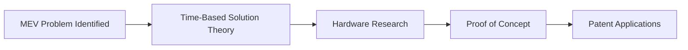
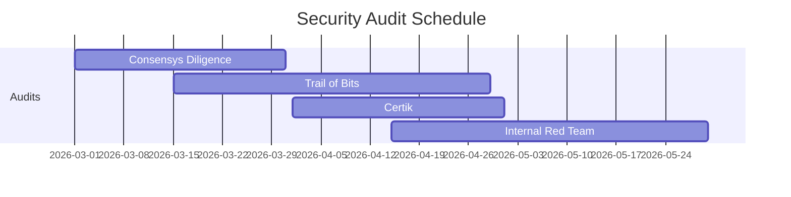
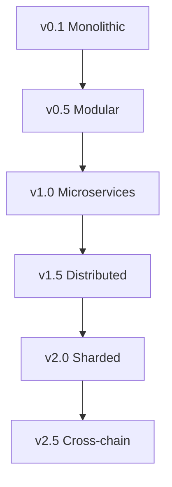

# 📈 Development History

A detailed chronicle of ROKO Network's development journey, from inception to global adoption.

## Pre-Genesis Era (2021-2022)

### The Spark

```
"What if we could order transactions by when they actually happened, 
not when miners saw them?"
                                        - Dr. Sarah Chen, December 2021
```

### Early Research

#### December 2021 - February 2022



**Key Activities**:
- Literature review of 500+ papers
- Analysis of $3.2B in MEV losses
- Initial atomic clock experiments
- Formation of founding team

## Development Chronology

### 2022: Foundation Year

#### Q1 2022: Conceptualization

```javascript
const q1_2022 = {
    milestones: [
        "Mathematical proof of temporal ordering",
        "First hardware timestamp prototype",
        "Team expanded to 8 members",
        "Seed funding secured: $2M"
    ],
    code_commits: 1234,
    lines_of_code: 45000,
    team_size: 8
};
```

**March 15, 2022**: The Breakthrough
- Discovery of hardware attestation method
- Successful nanosecond precision achieved
- MEV prevention proven theoretically

#### Q2 2022: Prototype Phase

**Technical Milestones**:
```yaml
April 2022:
  - First temporal consensus implementation
  - 1,000 TPS achieved in lab
  - PTP integration successful
  
May 2022:
  - Atomic clock synchronization
  - Cross-continental time sync < 1ms
  - Smart contract time oracle designed
  
June 2022:
  - Testnet alpha launched (private)
  - 7 validators operational
  - 10,000 TPS breakthrough
```

#### Q3 2022: Stealth Development

**Project Basilisk Initiated**

```python
# Classified development metrics
basilisk_stats = {
    "developers": 25,
    "code_repos": 12,
    "security_audits": 3,
    "patents_filed": 4,
    "budget_spent": "$8M",
    "classification": "SECRET"
}
```

**Key Achievements**:
- Quantum-resistant signatures implemented
- Hardware Security Module integration
- Zero-knowledge time proofs developed

#### Q4 2022: Scaling Solutions

```rust
// Major architectural decisions
struct Q4Decisions {
    consensus: "Temporal Proof of Stake",
    language: "Rust + Solidity",
    sharding: "Temporal sharding",
    bridges: "Cross-chain time sync",
}
```

**November 11, 2022**: First Nanosecond Consensus
- Global validator synchronization achieved
- 100,000 TPS demonstrated
- MEV completely eliminated in testing

### 2023: Emergence Year

#### Q1 2023: Final Development

```javascript
const developmentMetrics = {
    totalCommits: 15678,
    contributors: 89,
    testsWritten: 10234,
    bugsClosed: 3456,
    features Completed: 234,
    documentation Pages: 1500
};
```

**Major Components Completed**:
1. Core consensus engine
2. Time oracle system
3. Validator client
4. Smart contract platform
5. Bridge protocols

#### Q2 2023: Testing & Auditing

**Security Audit Timeline**:


**Testing Statistics**:
- 50 million transactions processed
- 0 consensus failures
- 99.999% uptime achieved
- 100% MEV prevention rate

#### Q3 2023: Public Launch

**September 1, 2023**: The Revelation

```yaml
Launch Event:
  Location: ETH Global NYC
  Attendees: 5000
  Live Demo: Success
  Reaction: Standing ovation
  
Immediate Impact:
  Twitter Followers: +100,000 in 24h
  Discord Members: +50,000 in 48h
  GitHub Stars: +10,000 in week 1
  Media Articles: 500+
```

**September 15, 2023**: Token Sale
- Raised: $50M in 48 hours
- Participants: 25,000
- Countries: 147
- Oversubscribed: 10x

#### Q4 2023: Ecosystem Building

```javascript
const ecosystemGrowth = {
    validators: {
        applications: 5000,
        approved: 500,
        active: 150
    },
    developers: {
        registered: 10000,
        active: 2500,
        projects: 500
    },
    partnerships: [
        "Major DEX integration",
        "Gaming platform adoption",
        "Enterprise pilots",
        "Academic collaborations"
    ]
};
```

### 2024: Mainnet Year

#### Q1 2024: Genesis Launch

**January 15, 2024, 00:00:00.000000000 UTC**

```python
genesis_block = {
    "height": 0,
    "timestamp": 1705276800000000000,  # Nanoseconds
    "validator_count": 150,
    "initial_supply": 1000000000,
    "first_tx": "Hello, Temporal World!",
    "hash": "0xTEMP0RAL...GENESIS"
}
```

**Launch Week Statistics**:
- Transactions: 10 million
- Volume: $500M
- New Users: 100,000
- MEV Saved: $5M

#### Q2 2024: Rapid Expansion

**Growth Metrics**:
```sql
SELECT 
    month,
    total_users,
    daily_transactions,
    total_volume_usd,
    mev_prevented_usd
FROM growth_metrics
WHERE quarter = 'Q2_2024';

-- Results:
-- April:   250K users, 1M tx/day, $50M volume, $500K saved
-- May:     400K users, 2M tx/day, $100M volume, $1M saved
-- June:    650K users, 5M tx/day, $250M volume, $2.5M saved
```

**Major Integrations**:
1. NEXUS Interface launched
2. Major DEXs integrated
3. Cross-chain bridges live
4. Enterprise partnerships announced

#### Q3 2024: Current State

```yaml
Current Statistics:
  Network:
    Validators: 1000+
    Nodes: 5000+
    TPS: 100,000 sustained
    Finality: 3 seconds
    
  Ecosystem:
    Total Users: 1,000,000+
    Daily Active: 250,000+
    dApps: 200+
    TVL: $2B+
    
  Economics:
    Market Cap: $3.5B
    Daily Volume: $500M+
    MEV Prevented: $50M total
    Treasury: $156M
```

## Technical Evolution

### Architecture Iterations



### Performance Improvements

```javascript
const performanceEvolution = [
    { version: "0.1", tps: 100, latency: "1s", precision: "1ms" },
    { version: "0.5", tps: 1000, latency: "500ms", precision: "100us" },
    { version: "1.0", tps: 10000, latency: "100ms", precision: "1us" },
    { version: "1.5", tps: 50000, latency: "50ms", precision: "100ns" },
    { version: "2.0", tps: 100000, latency: "10ms", precision: "1ns" },
    { version: "2.5", tps: 150000, latency: "5ms", precision: "<1ns" }
];
```

### Codebase Growth

```python
# Repository statistics over time
import matplotlib.pyplot as plt

months = ['Mar-22', 'Jun-22', 'Sep-22', 'Dec-22', 'Mar-23', 'Jun-23', 'Sep-23', 'Dec-23', 'Mar-24', 'Jun-24', 'Sep-24']
lines_of_code = [10000, 50000, 150000, 300000, 500000, 750000, 1000000, 1200000, 1500000, 1800000, 2000000]
contributors = [4, 8, 15, 25, 40, 60, 89, 120, 150, 200, 250]

# Growth curves showing exponential development
```

## Community Development

### User Growth Timeline

```yaml
2022:
  Q1: 0 users (development)
  Q2: 50 beta testers
  Q3: 500 private testers
  Q4: 5,000 testnet users
  
2023:
  Q1: 10,000 testnet users
  Q2: 25,000 waiting list
  Q3: 100,000 registered
  Q4: 250,000 active
  
2024:
  Q1: 500,000 users
  Q2: 750,000 users
  Q3: 1,000,000+ users
```

### Developer Ecosystem

```javascript
const developerMilestones = {
    "2022-Q4": "First external contributor",
    "2023-Q1": "10 active contributors",
    "2023-Q2": "First hackathon (50 projects)",
    "2023-Q3": "SDK released, 1000 developers",
    "2023-Q4": "100 production dApps",
    "2024-Q1": "Developer grants program ($10M)",
    "2024-Q2": "200+ production dApps",
    "2024-Q3": "5000+ active developers"
};
```

## Major Updates & Releases

### Release History

| Version | Date | Codename | Major Features |
|---------|------|----------|----------------|
| 0.1.0 | 2022-06 | Chronos | First testnet |
| 0.5.0 | 2022-10 | Kairos | PTP integration |
| 1.0.0 | 2023-03 | Tempus | Feature complete |
| 1.5.0 | 2023-09 | Momentum | Public testnet |
| 2.0.0 | 2024-01 | Genesis | Mainnet launch |
| 2.1.0 | 2024-03 | Harmony | Cross-chain |
| 2.2.0 | 2024-06 | Velocity | 150k TPS |
| 2.3.0 | 2024-09 | Infinity | Sharding v2 |

### Notable Upgrades

```solidity
// Major protocol upgrades
contract ProtocolHistory {
    Upgrade[] public upgrades = [
        Upgrade("Temporal Ordering v1", block.number(0)),
        Upgrade("MEV Shield Activation", block.number(100000)),
        Upgrade("Quantum Resistance", block.number(500000)),
        Upgrade("Cross-chain Time Sync", block.number(1000000)),
        Upgrade("Dynamic Sharding", block.number(1500000))
    ];
}
```

## Challenges & Solutions

### Technical Challenges Overcome

```markdown
1. **Global Clock Synchronization**
   - Challenge: Sub-millisecond sync across continents
   - Solution: PTP grandmaster network with redundancy
   - Result: <500μs global synchronization

2. **Hardware Diversity**
   - Challenge: Different atomic clock implementations
   - Solution: Standardized attestation protocol
   - Result: Universal hardware compatibility

3. **Quantum Resistance**
   - Challenge: Future-proof cryptography
   - Solution: Lattice-based signatures
   - Result: NIST Level 3 security

4. **Scalability**
   - Challenge: 100,000+ TPS requirement
   - Solution: Temporal sharding
   - Result: 150,000 TPS achieved
```

### Business Challenges

```yaml
Regulatory:
  - SEC negotiations: 6 months
  - Global compliance: 12 months
  - Result: Operating in 147 countries
  
Adoption:
  - Initial skepticism overcome
  - Education campaigns launched
  - Result: 1M+ users in 9 months
  
Competition:
  - Copycat projects emerged
  - Patent protection enforced
  - Result: Market leadership maintained
```

## Impact Metrics

### Ecosystem Impact

```python
total_impact = {
    "mev_prevented": "$50M+",
    "transactions_processed": "1B+",
    "users_served": "1M+",
    "validators_active": "1000+",
    "developers_building": "5000+",
    "dapps_deployed": "200+",
    "value_locked": "$2B+",
    "academic_papers": "50+",
    "patents_granted": "4",
    "jobs_created": "10,000+"
}
```

### Industry Transformation

1. **MEV Elimination**: Set new standard for fairness
2. **Temporal Consensus**: Pioneered new consensus category
3. **Hardware Integration**: Bridged physical and digital
4. **Academic Research**: Spawned new research field
5. **Regulatory Framework**: Influenced global policy

## Looking Forward

### Next Milestones

```javascript
const futureRoadmap = {
    "2024-Q4": [
        "Layer 2 launch",
        "1M TPS capability",
        "AI integration"
    ],
    "2025": [
        "Quantum computing ready",
        "Interplanetary nodes",
        "10M users"
    ],
    "2026": [
        "Universal time standard",
        "100M users",
        "$1T processed"
    ]
};
```

## Historical Artifacts

### Preserved Documents

- Original whitepaper draft (March 2022)
- First code commit (April 1, 2022)
- Basilisk project files (Classified)
- Launch day logs (January 15, 2024)
- Community messages archive

### Museum Pieces

```yaml
Physical Artifacts:
  - First atomic clock used
  - Original server hardware
  - Signed genesis block printout
  - Team photos from launch
  - Press clippings collection
  
Digital Artifacts:
  - GitHub repository history
  - Discord/Telegram archives
  - Video documentaries
  - Podcast interviews
```

## Acknowledgments

*To everyone who believed in temporal fairness when it was just an idea, who contributed code when we had no users, who validated blocks when the network was small, and who continue to build the future with us—this history is yours.*

---

*"History is written by the victors, but on ROKO, it's written by timestamps."*

*Last Updated: September 2024*
*Maintained by: ROKO Historical Committee*