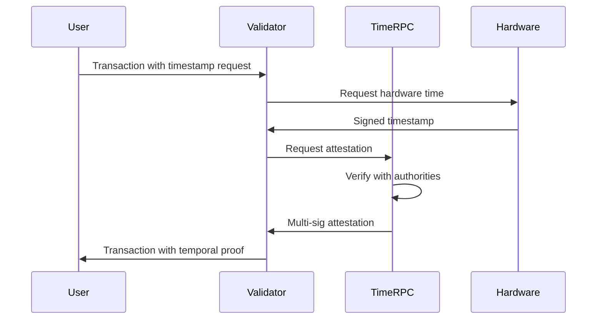

# Temporal Infrastructure

## The Foundation of Time-Based Consensus

ROKO Network's temporal infrastructure represents a paradigm shift in blockchain technology, introducing hardware-attested nanosecond precision to distributed consensus. This revolutionary approach solves fundamental problems that have plagued blockchain systems since their inception.

---

## Architecture Overview

### Three-Layer Temporal Stack

```
┌──────────────────────────────────────────────────────────┐
│                   Application Layer                      │
│         Temporal Smart Contracts & DApps                 │
├──────────────────────────────────────────────────────────┤
│                Temporal Consensus Layer                  │
│    NanoMoment • TimeRPC • Ordering • Attestation        │
├──────────────────────────────────────────────────────────┤
│                 Hardware Timing Layer                    │
│    OCP-TAP • IEEE 1588 PTP • Atomic Clocks • GPS        │
└──────────────────────────────────────────────────────────┘
```

Each layer provides critical functionality:

1. **Hardware Timing Layer**: Physical time sources and synchronization
2. **Temporal Consensus Layer**: Blockchain-specific time management
3. **Application Layer**: User-facing temporal features

---

## Hardware Timing Layer

### OCP-TAP Compliance

ROKO is the first blockchain built on **Open Compute Project Time Appliance** specifications:

#### Time Card Integration
```yaml
Time Card Specifications:
  - Manufacturer: OCP-compliant vendors
  - GPS/GNSS: Multi-constellation (GPS, Galileo, BeiDou)
  - Oscillator: OCXO with <1ppb stability
  - Interfaces: PCIe Gen3 x1
  - Accuracy: <100ns to UTC
  - Holdover: 24 hours at <1μs drift
```

#### Hardware Requirements for Validators

| Component | Specification | Purpose |
|-----------|--------------|---------|
| **Time Card** | OCP TAP 2.0+ | Hardware timestamp generation |
| **NIC** | Intel X710/E810 | PTP hardware timestamping |
| **CPU** | AVX2 support | Cryptographic operations |
| **GPS Antenna** | Active, 30dB gain | Time source reception |
| **Oscillator** | OCXO or better | Holdover stability |

### IEEE 1588 PTP Implementation

ROKO implements **Precision Time Protocol v2.1** for network-wide synchronization:

#### PTP Configuration
```ini
# ROKO PTP Profile
[global]
domainNumber              44    # ROKO domain
slaveOnly                 0     # Can be grandmaster
priority1                 128   # Standard priority
priority2                 128
clockClass                6     # GPS-locked
clockAccuracy            0x21   # <100ns
offsetScaledLogVariance 0xFFFF
free_running             0
freq_est_interval        1
dscp_event               46     # High priority
dscp_general             34
transportSpecific        0x0
ptp_dst_mac              01:1B:19:00:00:00
network_transport        L2
delay_mechanism          E2E    # End-to-end
time_stamping            hardware
```

#### Synchronization Hierarchy

```
                    GPS/GNSS Satellites
                           ↓
                    Stratum 0 (Atomic)
                           ↓
        ┌──────────────────┼──────────────────┐
        ↓                  ↓                  ↓
  Grandmaster 1      Grandmaster 2      Grandmaster 3
  (Region: US)       (Region: EU)        (Region: Asia)
        ↓                  ↓                  ↓
   Validators          Validators          Validators
   (Boundary)          (Boundary)          (Boundary)
        ↓                  ↓                  ↓
   Full Nodes          Full Nodes          Full Nodes
   (Ordinary)          (Ordinary)          (Ordinary)
```

### Time Source Redundancy

ROKO validators maintain multiple time sources for reliability:

1. **Primary**: GPS/GNSS with multi-constellation
2. **Secondary**: Network Time Security (NTS)
3. **Tertiary**: IEEE 1588 PTP from peers
4. **Backup**: Local atomic clock (Rubidium/Cesium)

---

## Temporal Consensus Layer

### NanoMoment Architecture

ROKO's revolutionary timestamp format:

#### Data Structure
```rust
pub struct NanoMoment {
    seconds: u64,      // Seconds since epoch
    nanoseconds: u32,  // Nanosecond precision
    attestation: [u8; 64], // Hardware signature
}

impl NanoMoment {
    pub fn now() -> Self {
        let hw_time = TimeCard::read_time();
        let attestation = TimeCard::sign(hw_time);
        
        NanoMoment {
            seconds: hw_time.seconds,
            nanoseconds: hw_time.nanoseconds,
            attestation: attestation.to_bytes(),
        }
    }
    
    pub fn verify(&self) -> bool {
        TimeCard::verify_signature(
            self.seconds,
            self.nanoseconds,
            &self.attestation
        )
    }
}
```

#### Precision Comparison

| Blockchain | Timestamp Type | Precision | Range |
|-----------|---------------|-----------|-------|
| Bitcoin | uint32 | 1 second | 136 years |
| Ethereum | uint256 | 1 second | Heat death of universe |
| **ROKO** | **u128** | **1 nanosecond** | **10^19 years** |

### TimeRPC Authority Network

Decentralized time validation system:

#### Authority Node Requirements
```javascript
const authorityConfig = {
    // Hardware requirements
    timeCard: 'OCP-TAP-2.0',
    clockClass: 6, // GPS-locked
    accuracy: '<25ns',
    
    // Network requirements
    bandwidth: '10Gbps',
    latency: '<5ms to peers',
    uptime: '>99.9%',
    
    // Staking requirements
    stake: '1000000 ROKO',
    reputation: 'GOLD',
    activeTime: '>6 months'
};
```

#### Attestation Protocol



### Temporal Ordering Algorithm

ROKO's deterministic transaction ordering:

```python
class TemporalOrdering:
    def order_transactions(self, tx_pool):
        # Step 1: Verify hardware attestations
        valid_txs = []
        for tx in tx_pool:
            if self.verify_timestamp(tx):
                valid_txs.append(tx)
        
        # Step 2: Sort by NanoMoment
        valid_txs.sort(key=lambda x: x.nano_moment)
        
        # Step 3: Resolve conflicts (same nanosecond)
        for i in range(len(valid_txs) - 1):
            if valid_txs[i].nano_moment == valid_txs[i+1].nano_moment:
                # Use deterministic tiebreaker
                self.resolve_conflict(valid_txs[i], valid_txs[i+1])
        
        # Step 4: Create temporal proof
        proof = self.create_temporal_proof(valid_txs)
        
        return valid_txs, proof
    
    def verify_timestamp(self, tx):
        # Verify hardware signature
        if not tx.timestamp.verify():
            return False
        
        # Check temporal bounds
        current = NanoMoment.now()
        drift = abs(current - tx.timestamp)
        
        return drift < MAX_ALLOWED_DRIFT  # 100ms
```

---

## MEV Prevention Mechanism

### How ROKO Eliminates MEV

Traditional blockchains allow validators to reorder transactions:

```
Traditional: Validators choose order
├── See all pending transactions
├── Calculate profit opportunities
├── Reorder for maximum extraction
└── Users pay the price
```

ROKO enforces temporal ordering:

```
ROKO: Time determines order
├── Hardware timestamps at signing
├── Cryptographic proof of time
├── Validators must respect order
└── Fair execution guaranteed
```

### Temporal Fairness Proof

```rust
pub struct TemporalProof {
    block_height: u64,
    transactions: Vec<Transaction>,
    ordering_proof: MerkleRoot,
    validator_signatures: Vec<Signature>,
}

impl Block {
    pub fn validate_temporal_order(&self) -> Result<(), Error> {
        // Verify each transaction's timestamp
        for tx in &self.transactions {
            tx.timestamp.verify()?;
        }
        
        // Ensure monotonic ordering
        for window in self.transactions.windows(2) {
            if window[0].timestamp > window[1].timestamp {
                return Err(Error::TemporalOrderViolation);
            }
        }
        
        // Verify no gaps indicate hidden transactions
        self.verify_no_censorship()?;
        
        Ok(())
    }
}
```

---

## Network Synchronization

### Global Time Consensus

ROKO maintains network-wide time agreement:

#### Synchronization Protocol
```yaml
Phase 1 - Discovery:
  - Validators announce time capabilities
  - Exchange clock quality metrics
  - Establish peer relationships

Phase 2 - Synchronization:
  - PTP message exchange
  - Offset calculation
  - Drift compensation
  
Phase 3 - Consensus:
  - Vote on global time
  - Weighted by clock quality
  - Penalize drifting validators

Phase 4 - Attestation:
  - Sign agreed time
  - Broadcast to network
  - Include in block header
```

### Drift Management

```javascript
class DriftManager {
    constructor() {
        this.maxDrift = 100; // nanoseconds
        this.penalties = new Map();
    }
    
    checkValidatorDrift(validator, reportedTime) {
        const networkTime = this.getNetworkConsensusTime();
        const drift = Math.abs(reportedTime - networkTime);
        
        if (drift > this.maxDrift) {
            // Progressive penalties
            const violations = this.penalties.get(validator) || 0;
            this.penalties.set(validator, violations + 1);
            
            if (violations > 10) {
                this.slashValidator(validator, drift);
            } else if (violations > 5) {
                this.reduceValidatorWeight(validator);
            } else {
                this.warnValidator(validator);
            }
        }
        
        return drift <= this.maxDrift;
    }
}
```

---

## Temporal Smart Contracts

### Time-Native Operations

ROKO smart contracts have built-in temporal functions:

```solidity
pragma temporal ^1.0.0;

contract TemporalAuction {
    using NanoTime for uint128;
    
    struct Auction {
        uint128 startTime;
        uint128 endTime;
        address highestBidder;
        uint256 highestBid;
    }
    
    mapping(uint => Auction) public auctions;
    
    modifier onlyDuring(uint auctionId) {
        require(
            Time.now() >= auctions[auctionId].startTime,
            "Auction not started"
        );
        require(
            Time.now() <= auctions[auctionId].endTime,
            "Auction ended"
        );
        _;
    }
    
    function bid(uint auctionId) 
        public 
        payable 
        onlyDuring(auctionId) 
    {
        // Bid timestamp is hardware-attested
        uint128 bidTime = Time.now();
        
        // Automatic ordering by time
        // No front-running possible
        processBid(auctionId, msg.sender, msg.value, bidTime);
    }
    
    function scheduleExecution(uint128 targetTime, bytes calldata data) 
        public 
    {
        // Contract execution at exact nanosecond
        Time.scheduleCall(targetTime, address(this), data);
    }
}
```

---

## Performance Characteristics

### Timing Metrics

| Metric | Value | Industry Standard |
|--------|-------|------------------|
| **Timestamp Precision** | 10 nanoseconds | 1 second |
| **Network Sync** | <100 nanoseconds | >1 second |
| **Block Time** | 2.5 seconds | 12 seconds |
| **Finality** | Instant (1 block) | 6+ blocks |
| **Time to Attestation** | <50ms | N/A |
| **Drift Tolerance** | 100ns | 500ms |

### Scalability

ROKO's temporal infrastructure scales linearly:

```
Validators: 100 → 1000
├── Sync precision: 100ns → 100ns (maintained)
├── Attestation time: 50ms → 55ms (minimal increase)
├── Block time: 2.5s → 2.5s (constant)
└── Throughput: 50K TPS → 500K TPS (linear scale)
```

---

## Security Considerations

### Time-Based Attack Vectors

ROKO prevents common temporal attacks:

#### 1. Time Manipulation Attacks
- **Prevention**: Hardware attestation required
- **Detection**: Multi-source verification
- **Response**: Automatic slashing

#### 2. Replay Attacks
- **Prevention**: Monotonic nonce + timestamp
- **Detection**: Duplicate detection in mempool
- **Response**: Transaction rejection

#### 3. Eclipse Attacks
- **Prevention**: Multiple time sources
- **Detection**: Peer time comparison
- **Response**: Isolation and recovery

### Cryptographic Security

```rust
impl TemporalSecurity {
    pub fn generate_proof(&self, timestamp: NanoMoment) -> Proof {
        // Hardware signature
        let hw_sig = self.time_card.sign(&timestamp);
        
        // Validator signature
        let val_sig = self.validator_key.sign(&hw_sig);
        
        // Network attestation
        let net_att = self.request_attestation(&val_sig);
        
        Proof {
            timestamp,
            hardware_signature: hw_sig,
            validator_signature: val_sig,
            network_attestation: net_att,
            merkle_proof: self.create_merkle_proof(),
        }
    }
}
```

---

## Integration Guidelines

### For Validators

```bash
# 1. Install time card drivers
sudo apt-get install ocp-timecard-driver

# 2. Configure PTP
sudo ptp4l -i eth0 -f /etc/ptp/roko.conf

# 3. Verify synchronization
roko time verify
# Output: Sync accuracy: 45ns ✓

# 4. Enable temporal consensus
roko config set consensus.temporal true
```

### For Developers

```javascript
// Always use temporal functions
const timestamp = await roko.time.now();

// Never use JavaScript Date
// BAD: new Date().getTime()
// GOOD: roko.time.now()

// Verify temporal proofs
const isValid = await roko.time.verify(
    transaction.timestamp,
    transaction.proof
);

// Schedule time-based execution
await contract.scheduleAt(
    NanoMoment.future(5, 'minutes'),
    'executePayment',
    [recipient, amount]
);
```

---

## Future Developments

### Roadmap

#### Phase 1: Enhanced Precision (Q2 2025)
- Sub-nanosecond precision (picoseconds)
- Optical clock integration
- Quantum timing resistance

#### Phase 2: Cross-Chain Time (Q3 2025)
- Temporal bridges to other blockchains
- Universal time coordination protocol
- Time-locked atomic swaps

#### Phase 3: Global Time Network (Q4 2025)
- Satellite time nodes
- Underwater cable timing
- Deep space time coordination

---

## Conclusion

ROKO's temporal infrastructure represents the most significant advancement in blockchain technology since the invention of Bitcoin. By solving the fundamental problem of time coordination in distributed systems, we enable entirely new categories of applications while eliminating longstanding issues like MEV.

The combination of OCP-TAP hardware, IEEE 1588 synchronization, and our innovative NanoMoment architecture creates an unparalleled platform for time-sensitive decentralized applications.

---

<div align="center">

**Ready to Build?**

[Quick Start](../getting-started/quick-start.md) | [Developer SDK](../developers/sdks.md) | [Join Network](../validators/getting-started.md)

</div>