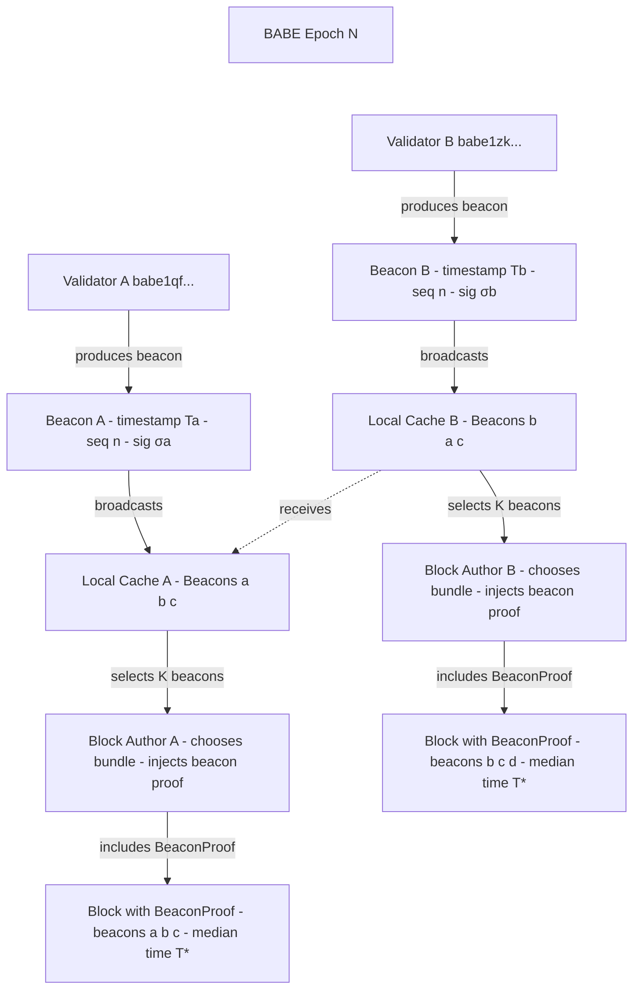

# Time Beacons

## Decentralized Time Attestation System

Time Beacons are the foundation of ROKO's temporal consensus. Rather than trusting a single block producer's timestamp, ROKO requires validators to continuously broadcast signed timestamps that collectively prove when events occurred.

---

## The Problem with `block.timestamp`

Traditional blockchains have loose timestamp constraints:

> When a node creates a block:
> - The node checks its local system clock
> - It sets the block's timestamp (possibly adjusted)
> - Other nodes verify basic constraints

**Typical constraints:**
- Must be greater than parent block's timestamp
- Cannot be too far in the future (Bitcoin: 2 hours, Ethereum PoS: 15 seconds)

This looseness enables timestamp manipulation and front-running.

---

## How Time Beacons Work

### Beacon Structure

Each validator produces signed beacons at regular intervals:

```json
{
  "validatorId": "babe1qf...2k7h",
  "timestampUs": 1730123456789000,
  "sequence": 42,
  "signature": "0x8afc1c2d4e...dbe1",
  "epochRandomness": "0xb6f0c67a91...a0ff"
}
```

```html
<table class="spec-table">
  <thead>
    <tr><th>Field</th><th>Purpose</th></tr>
  </thead>
  <tbody>
    <tr><td><code>validatorId</code></td><td>Identifies the beacon producer</td></tr>
    <tr><td><code>timestampUs</code></td><td>Microsecond-precision timestamp</td></tr>
    <tr><td><code>sequence</code></td><td>Monotonic counter preventing replay</td></tr>
    <tr><td><code>signature</code></td><td>Validator's cryptographic signature</td></tr>
    <tr><td><code>epochRandomness</code></td><td>Epoch-derived value for verification</td></tr>
  </tbody>
</table>
```

### Beacon Frequency

- **Launch target**: 150ms intervals
- Configurable per-network
- Higher frequency = tighter time consensus

---

## Beacon Flow



Each validator:
1. Produces beacons from their Time Card
2. Signs and broadcasts to the network
3. Caches beacons from other validators
4. Uses cached beacons when producing blocks

---

## Beacon Proofs in Blocks

When producing a block, the validator includes a **Beacon Proof**:

```box:Block #12,345
Parent Hash:      0x4fd8…8c2a
Author:           babe1qf…2k7h
State Root:       0xa7b1…932e
Extrinsics Root:  0x33aa…fe45

─── Time Beacon Proof ───────────────────────────────────────────────────────

Claimed Block Time:   2024-09-28 10:17:36.789 UTC
Spread max-min:       42 ms
Median canonical:     2024-09-28 10:17:36.791 UTC

┌─────────────┬──────────────────┬────────────────────┬──────────┬────────────────┐
│ Beacon      │ Validator        │ Timestamp (µs)     │ Sequence │ Signature      │
├─────────────┼──────────────────┼────────────────────┼──────────┼────────────────┤
│ Beacon 1    │ babe1qf…2k7h     │ 1730123456789000   │ 42       │ 0x8afc…dbe1    │
│ Beacon 2    │ babe1zk…xp4m     │ 1730123456798000   │ 105      │ 0xe4ab…9910    │
│ Beacon 3    │ babe1mv…hnt9     │ 1730123456776000   │ 88       │ 0x91cd…0f2b    │
└─────────────┴──────────────────┴────────────────────┴──────────┴────────────────┘
```

The block timestamp must match the **median** of the included beacon timestamps.

### Proof Validation

1. Verify each beacon signature
2. Confirm beacons are within drift tolerance
3. Calculate median timestamp
4. Verify block timestamp matches median
5. Check beacon freshness (not stale)

---

## Drift Tolerance

Blockchain relies on gossiping - messages take time to propagate. ROKO handles this with configurable drift tolerance:

```html
<table class="spec-table">
  <thead>
    <tr><th>Phase</th><th>Drift Tolerance</th><th>Notes</th></tr>
  </thead>
  <tbody>
    <tr><td><strong>Launch</strong></td><td>2 seconds</td><td>Similar to existing chains</td></tr>
    <tr><td><strong>Mature network</strong></td><td>500ms target</td><td>With sufficient validator density</td></tr>
    <tr><td><strong>Aspirational</strong></td><td>Sub-100ms</td><td>With optimized networking</td></tr>
  </tbody>
</table>
```

The tolerance window can be adjusted via governance as network conditions improve.

---

## Slashing Bad Actors

Validators producing out-of-sync beacons can be detected and penalized:

```
Fresh beacons collected
        │
        ▼
Detect drift beyond tolerance
        │
        ▼
Include slashing transaction with drift proof
        │
        ▼
Validator penalized
```

Slashing is configurable and exploratory at launch.

---

## Storage Optimization

Beacons live in runtime memory - they're temporary:
- Only stored when included in a block proof
- Or referenced in a slashing transaction
- Reduces on-chain storage burden

---

## Integration with Consensus

Time Beacons work **alongside** BABE/GRANDPA, not replacing them:

- **BABE**: Block production and slot assignment (unchanged)
- **GRANDPA**: Finality (unchanged)
- **Beacons**: Add temporal proof requirements to blocks

This modular approach allows other Substrate chains to adopt beacon technology.

---

## Current Research Areas

The team is actively working on:

1. **Beacon back-dating prevention**: Ensuring users can't sign transactions with stale beacons
2. **Gossip reliability**: Handling cases where honest block producers miss transactions due to propagation delays
3. **Proof optimization**: Reducing beacon proof size in blocks and transactions

---

## See Also

- [Temporal Transactions](./temporal-transactions.md) - How beacons enable timestamped transactions
- [Consensus Mechanism](./consensus.md) - BABE/GRANDPA integration
- [MEV Prevention](./mev-prevention.md) - How temporal ordering prevents MEV
