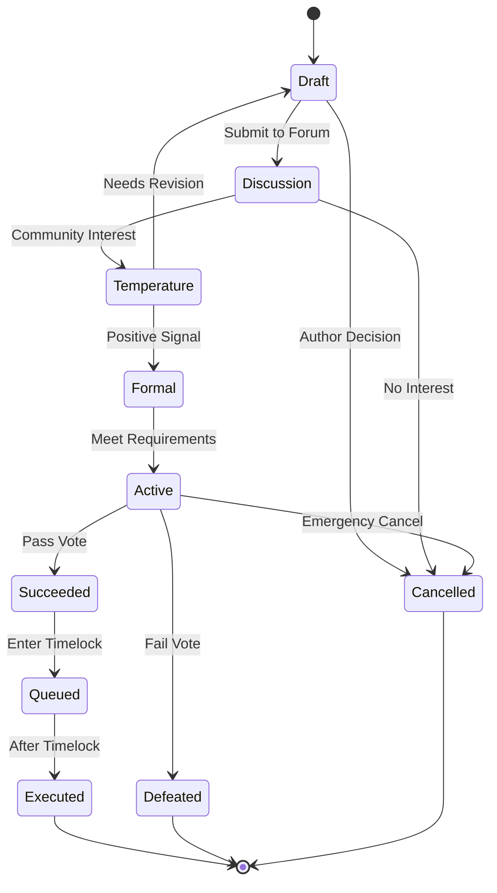

# 📝 Proposal Process

Learn how to create, submit, and execute governance proposals on the ROKO Network.

## Proposal Overview

### What is a Proposal?

A proposal is a formal request for the ROKO DAO to take a specific action, such as:
- Protocol upgrades
- Parameter changes
- Treasury allocations
- Working group elections
- Policy modifications

### Proposal Categories

| Category | Description | Examples |
|----------|-------------|----------|
| **Technical** | Protocol improvements | Upgrade contracts, add features |
| **Economic** | Tokenomics changes | Adjust fees, modify inflation |
| **Treasury** | Fund allocation | Grants, partnerships, expenses |
| **Governance** | DAO operations | Elections, policy changes |
| **Emergency** | Critical fixes | Security patches, exploit response |

## Creating a Proposal

### Step 1: Community Discussion

#### Forum Post Template
```markdown
# [DISCUSSION] Your Proposal Title

## Summary
One paragraph explaining what you want to change

## Motivation
Why this change is needed

## Specification
Detailed technical description

## Impact
- Positive outcomes
- Potential risks
- Affected stakeholders

## Timeline
Proposed implementation schedule

## Budget
Required resources (if any)
```

#### Discussion Period
- **Minimum**: 72 hours
- **Recommended**: 7 days
- **Location**: [forum.roko.network](https://forum.roko.network)

### Step 2: Temperature Check

```javascript
// Off-chain sentiment gauge
const temperatureCheck = {
    title: "Should we implement XYZ?",
    options: ["Yes, proceed", "No, needs work", "Abstain"],
    duration: 3 * 24 * 60 * 60, // 3 days
    platform: "snapshot",
    requirements: {
        participation: 100, // minimum voters
        support: 0.6 // 60% yes to proceed
    }
};
```

### Step 3: Formal Proposal

#### Required Components

```typescript
interface Proposal {
    title: string;              // Clear, descriptive title
    category: ProposalType;      // Technical, Economic, etc.
    author: Address;            // Proposer address
    sponsor: Address;           // Sponsor with sufficient ROKO
    description: string;        // Full markdown description
    specification: {            // Technical details
        contracts: Address[];
        functions: string[];
        parameters: any[];
        values: BigNumber[];
    };
    timeline: {                 // Implementation timeline
        discussion: number;
        voting: number;
        timelock: number;
        execution: number;
    };
    budget: {                   // Resource requirements
        roko: BigNumber;
        usdc: BigNumber;
        hours: number;
    };
}
```

#### Submission Requirements

| Requirement | Standard | Emergency |
|-------------|----------|----------|
| ROKO Balance | 10,000 | 100,000 |
| Account Age | 30 days | 7 days |
| Reputation | 10+ | 50+ |
| Sponsor | Optional | Required |
| Deposit | 1,000 ROKO | 10,000 ROKO |

## Proposal Lifecycle

### State Machine



### Timeline Phases

```python
class ProposalTimeline:
    def __init__(self, proposal_type):
        self.phases = {
            'standard': {
                'discussion': 7 * 24 * 3600,     # 7 days
                'voting': 7 * 24 * 3600,          # 7 days
                'timelock': 2 * 24 * 3600,        # 2 days
                'grace': 14 * 24 * 3600           # 14 days to execute
            },
            'emergency': {
                'discussion': 6 * 3600,           # 6 hours
                'voting': 24 * 3600,              # 24 hours
                'timelock': 6 * 3600,             # 6 hours
                'grace': 24 * 3600                # 24 hours to execute
            }
        }
        
    def get_total_time(self, type):
        phase = self.phases[type]
        return sum(phase.values())
```

## Voting Process

### Voting Options

```solidity
enum VoteType {
    Against,     // 0: Oppose proposal
    For,         // 1: Support proposal
    Abstain      // 2: Neutral, counts for quorum
}

struct Vote {
    address voter;
    VoteType support;
    uint256 weight;
    uint256 nanotime;
    string reason;  // Optional on-chain comment
}
```

### Calculating Voting Power

```javascript
function calculateVotingPower(voter) {
    let power = 0;
    
    // Base ROKO tokens
    power += rokoBalance(voter);
    
    // pwROKO with multiplier
    const locks = getPwRokoLocks(voter);
    for (const lock of locks) {
        power += lock.amount * lock.multiplier;
    }
    
    // Delegated power
    power += getDelegatedPower(voter);
    
    // Reputation boost (up to 50%)
    const reputation = getReputation(voter);
    power *= (1 + reputation / 200);
    
    // Validator boost (20%)
    if (isValidator(voter)) {
        power *= 1.2;
    }
    
    return Math.floor(power);
}
```

### Quorum Requirements

| Proposal Type | Base Quorum | Dynamic Range |
|---------------|-------------|---------------|
| Operational | 5% | 3% - 8% |
| Technical | 10% | 6% - 15% |
| Economic | 15% | 10% - 20% |
| Constitutional | 25% | 20% - 30% |
| Emergency | 3% | Fixed |

### Dynamic Quorum Adjustment

```python
def calculate_dynamic_quorum(base_quorum, recent_participation):
    """
    Adjusts quorum based on recent participation trends
    """
    avg_participation = np.mean(recent_participation[-10:])
    
    if avg_participation < 0.1:  # Very low participation
        adjustment = 0.7
    elif avg_participation < 0.2:  # Low participation
        adjustment = 0.85
    elif avg_participation > 0.5:  # High participation
        adjustment = 1.2
    else:  # Normal participation
        adjustment = 1.0
    
    adjusted = base_quorum * adjustment
    
    # Apply bounds
    min_quorum = base_quorum * 0.6
    max_quorum = base_quorum * 1.5
    
    return np.clip(adjusted, min_quorum, max_quorum)
```

## Proposal Execution

### Smart Contract Implementation

```solidity
contract GovernorContract {
    struct ProposalCore {
        address proposer;
        uint256 eta;  // Execution time
        uint256 startBlock;
        uint256 endBlock;
        uint256 forVotes;
        uint256 againstVotes;
        uint256 abstainVotes;
        bool canceled;
        bool executed;
    }
    
    mapping(uint256 => ProposalCore) public proposals;
    
    function execute(
        uint256 proposalId
    ) public payable {
        require(
            state(proposalId) == ProposalState.Queued,
            "Not queued"
        );
        
        ProposalCore storage proposal = proposals[proposalId];
        proposal.executed = true;
        
        // Get temporal attestation
        uint256 nanotime = timeOracle.getNanoTime();
        
        // Execute proposal actions
        for (uint i = 0; i < targets.length; i++) {
            (bool success, bytes memory returnData) = targets[i].call{
                value: values[i]
            }(calldatas[i]);
            
            require(success, "Transaction failed");
        }
        
        emit ProposalExecuted(proposalId, nanotime);
    }
}
```

### Timelock Security

```solidity
contract Timelock {
    uint public constant MIN_DELAY = 2 days;
    uint public constant MAX_DELAY = 30 days;
    uint public constant GRACE_PERIOD = 14 days;
    
    mapping(bytes32 => bool) public queuedTransactions;
    
    function queueTransaction(
        address target,
        uint value,
        string memory signature,
        bytes memory data,
        uint eta
    ) public returns (bytes32) {
        require(
            msg.sender == admin,
            "Only admin"
        );
        require(
            eta >= block.timestamp + MIN_DELAY,
            "ETA too soon"
        );
        
        bytes32 txHash = keccak256(
            abi.encode(target, value, signature, data, eta)
        );
        queuedTransactions[txHash] = true;
        
        emit QueueTransaction(txHash, target, value, signature, data, eta);
        return txHash;
    }
}
```

## Proposal Types

### 1. Parameter Change

```javascript
const parameterProposal = {
    type: "PARAMETER_CHANGE",
    changes: [
        {
            contract: "0xROKO...",
            parameter: "minValidatorStake",
            currentValue: "100000000000000000000000", // 100k ROKO
            newValue: "150000000000000000000000"     // 150k ROKO
        }
    ],
    justification: "Increase security by raising minimum stake"
};
```

### 2. Treasury Allocation

```javascript
const treasuryProposal = {
    type: "TREASURY_ALLOCATION",
    allocations: [
        {
            recipient: "0xDeveloper...",
            amount: "50000000000000000000000", // 50k ROKO
            token: "ROKO",
            purpose: "Q1 Development Grant",
            milestones: [
                {description: "MVP Launch", amount: "40%"},
                {description: "Audit Complete", amount: "30%"},
                {description: "Mainnet Deploy", amount: "30%"}
            ]
        }
    ]
};
```

### 3. Contract Upgrade

```javascript
const upgradeProposal = {
    type: "CONTRACT_UPGRADE",
    upgrades: [
        {
            proxy: "0xProxy...",
            oldImplementation: "0xOld...",
            newImplementation: "0xNew...",
            initData: "0x..."
        }
    ],
    auditReport: "ipfs://QmAudit...",
    testResults: "ipfs://QmTests..."
};
```

## Best Practices

### Writing Effective Proposals

1. **Clear Title**: Descriptive and searchable
2. **Executive Summary**: One paragraph overview
3. **Problem Statement**: What issue does this solve?
4. **Solution**: Detailed implementation plan
5. **Impact Analysis**: Benefits and risks
6. **Success Metrics**: How to measure success
7. **Budget Breakdown**: Detailed cost analysis
8. **Timeline**: Realistic implementation schedule

### Building Support

```python
class ProposalStrategy:
    def build_support(self, proposal):
        steps = [
            self.engage_stakeholders(),
            self.address_concerns(),
            self.find_champions(),
            self.create_momentum(),
            self.maintain_communication()
        ]
        
        return all(steps)
    
    def engage_stakeholders(self):
        # Identify and engage key voters
        stakeholders = [
            'validators',
            'large_holders',
            'working_groups',
            'community_leaders'
        ]
        # ...
```

## Proposal Templates

### Technical Upgrade Template

```markdown
# RIP-XXX: [Technical Upgrade Title]

## Abstract
Brief technical summary

## Motivation
Why this upgrade is necessary

## Specification
### Current Implementation
- Current code/architecture
- Known issues

### Proposed Changes
- New implementation
- Key improvements

### Technical Details
- Contract addresses
- Function signatures
- Parameter changes

## Security Considerations
- Audit requirements
- Risk assessment
- Rollback plan

## Test Results
- Unit tests
- Integration tests
- Simulation results

## Implementation
- Development: X weeks
- Testing: Y weeks
- Deployment: Z days
```

## Monitoring & Analytics

### Proposal Metrics

```sql
SELECT 
    proposal_id,
    title,
    category,
    for_votes,
    against_votes,
    abstain_votes,
    (for_votes * 100.0 / (for_votes + against_votes)) as approval_rate,
    unique_voters,
    total_voting_power,
    execution_status
FROM proposals
WHERE created_at > NOW() - INTERVAL '30 days'
ORDER BY created_at DESC;
```

### Success Tracking

```javascript
const trackProposalSuccess = (proposalId) => {
    const metrics = {
        votingParticipation: getVoterCount(proposalId) / getTotalVoters(),
        supportRate: getForVotes(proposalId) / getTotalVotes(proposalId),
        executionTime: getExecutionTime(proposalId),
        implementationSuccess: checkImplementationMetrics(proposalId),
        communityFeedback: analyzeSentiment(proposalId)
    };
    
    return calculateSuccessScore(metrics);
};
```

## Common Issues & Solutions

| Issue | Solution |
|-------|----------|
| Low participation | Improve communication, adjust quorum |
| Proposal fails | Address feedback, revise and resubmit |
| Technical complexity | Provide clear documentation, demos |
| Execution fails | Test thoroughly, have rollback plan |
| Spam proposals | Increase deposit requirements |

## Resources

### Tools
- **Proposal Builder**: [builder.roko.network](https://builder.roko.network)
- **Voting Interface**: [vote.roko.network](https://vote.roko.network)
- **Analytics Dashboard**: [analytics.roko.network](https://analytics.roko.network)
- **Simulation Tool**: [simulate.roko.network](https://simulate.roko.network)

### Documentation
- [Governance Overview](./overview.md)
- [Voting Power](./multi-token.md)
- [Working Groups](./working-groups.md)
- [Treasury Management](./treasury.md)

## Support

- **Discord**: [discord.gg/roko-proposals](https://discord.gg/roko-proposals)
- **Forum**: [forum.roko.network](https://forum.roko.network)
- **Email**: proposals@roko.network

---

*"Every proposal shapes the future of ROKO"*