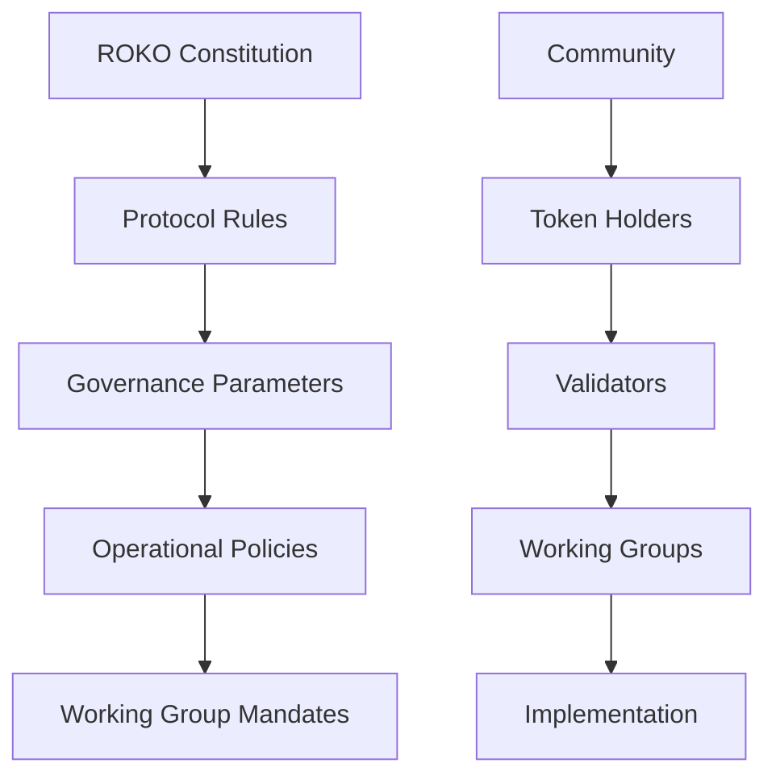
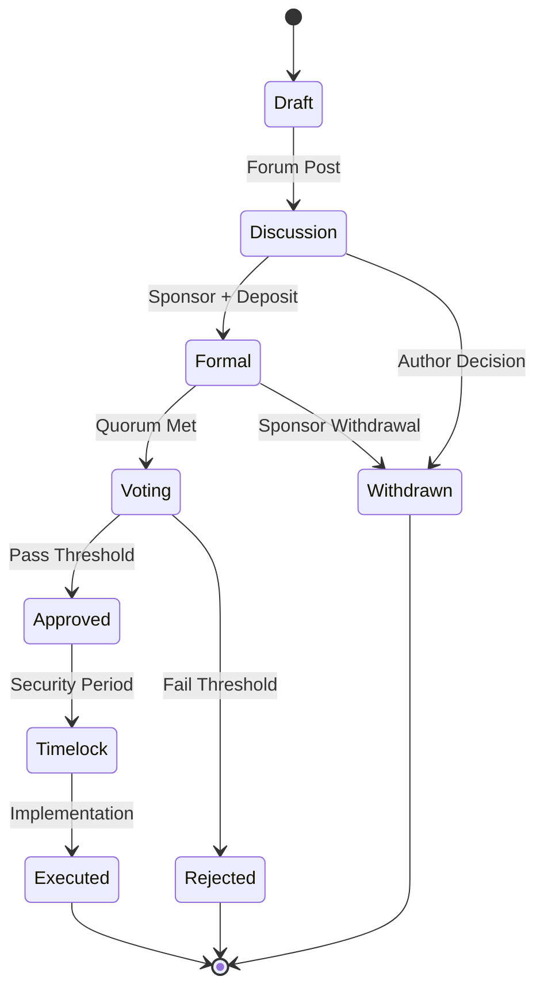

# 🗳️ Governance Structure

The ROKO Network implements a sophisticated multi-tier governance structure that leverages temporal consensus for fair and transparent decision-making.

## Governance Framework

### Constitutional Hierarchy



### Separation of Powers

#### Legislative Branch (Token Holders)
- Propose protocol changes
- Vote on treasury allocation
- Elect working group members
- Ratify major decisions

#### Executive Branch (Working Groups)
- Implement approved proposals
- Manage day-to-day operations
- Execute treasury spending
- Coordinate development

#### Judicial Branch (Security Council)
- Resolve disputes
- Interpret governance rules
- Emergency interventions
- Protocol security

## Voting Power Distribution

### Token-Based Voting Weight

```javascript
function calculateVotingPower(address voter) {
    let power = 0;
    
    // Base ROKO tokens (1:1)
    power += rokoBalance[voter];
    
    // pwROKO tokens (1.5x - 4x multiplier)
    const lockDuration = pwRokoLockTime[voter];
    const multiplier = getMultiplier(lockDuration);
    power += pwRokoBalance[voter] * multiplier;
    
    // Validator bonus (1.2x for active validators)
    if (isActiveValidator(voter)) {
        power *= 1.2;
    }
    
    // Reputation multiplier (up to 1.5x)
    power *= getReputationMultiplier(voter);
    
    // Quadratic reduction for whales
    if (power > WHALE_THRESHOLD) {
        power = sqrt(power) * WHALE_FACTOR;
    }
    
    return power;
}
```

### Delegation Mechanism

#### Direct Delegation
```solidity
contract Delegation {
    mapping(address => address) public delegates;
    mapping(address => uint256) public delegatedPower;
    
    function delegate(address to) external {
        require(to != msg.sender, "Cannot delegate to self");
        require(delegates[to] == address(0), "No delegation chains");
        
        // Remove previous delegation
        if (delegates[msg.sender] != address(0)) {
            delegatedPower[delegates[msg.sender]] -= votingPower[msg.sender];
        }
        
        // Add new delegation
        delegates[msg.sender] = to;
        delegatedPower[to] += votingPower[msg.sender];
        
        emit Delegated(msg.sender, to, votingPower[msg.sender]);
    }
}
```

## Decision-Making Process

### Proposal Types

| Type | Description | Quorum | Threshold | Timelock |
|------|-------------|--------|-----------|----------|
| **Operational** | Daily operations | 5% | 50% | 1 day |
| **Technical** | Code upgrades | 10% | 60% | 3 days |
| **Economic** | Tokenomics changes | 15% | 66% | 7 days |
| **Constitutional** | Core changes | 25% | 75% | 14 days |
| **Emergency** | Critical fixes | 3% | 80% | 6 hours |

### Temporal Voting Process

```python
class TemporalVoting:
    def __init__(self):
        self.proposals = {}
        self.votes = {}
        
    def cast_vote(self, proposal_id, voter, choice, nanotime):
        # Verify temporal ordering
        if proposal_id in self.votes:
            last_vote = max(self.votes[proposal_id], key=lambda v: v.nanotime)
            assert nanotime > last_vote.nanotime, "Out of temporal order"
        
        # Calculate time-weighted power
        time_remaining = self.proposals[proposal_id].end_time - nanotime
        time_weight = time_remaining / self.proposals[proposal_id].duration
        
        # Apply vote with temporal weight
        vote_power = calculate_voting_power(voter) * time_weight
        
        self.votes[proposal_id].append({
            'voter': voter,
            'choice': choice,
            'power': vote_power,
            'nanotime': nanotime,
            'final': False
        })
        
        return vote_power
```

## Working Groups

### Structure and Responsibilities

#### Technical Working Group
```yaml
Composition:
  Core Developers: 5
  Community Developers: 4
  Security Experts: 2
  
Responsibilities:
  - Protocol upgrades
  - Code review
  - Technical standards
  - Performance optimization
  
Budget: 500,000 ROKO/year
Decision Making: 7/11 majority
Term: 2 years
```

#### Treasury Working Group
```yaml
Composition:
  Finance Experts: 3
  Community Representatives: 3
  Legal Advisor: 1
  
Responsibilities:
  - Treasury management
  - Grant distribution
  - Budget allocation
  - Financial reporting
  
Budget: Manages main treasury
Decision Making: 5/7 majority
Term: 1 year rotating
```

#### Ecosystem Working Group
```yaml
Composition:
  Business Development: 4
  Marketing: 3
  Community Managers: 3
  
Responsibilities:
  - Partnerships
  - Marketing campaigns
  - Community growth
  - Event organization
  
Budget: 1,000,000 ROKO/year
Decision Making: 6/10 majority
Term: 6 months
```

### Working Group Elections

```javascript
const electWorkingGroup = async (groupType) => {
    const candidates = await getCandidates(groupType);
    const voters = await getEligibleVoters();
    
    // Temporal voting period
    const votingPeriod = {
        start: getCurrentNanoTime(),
        end: getCurrentNanoTime() + (7 * 24 * 60 * 60 * 1e9), // 7 days
        quorum: 0.15 // 15% participation required
    };
    
    // Ranked choice voting
    const results = await rankedChoiceVote({
        candidates,
        voters,
        period: votingPeriod,
        seats: GROUP_SIZES[groupType]
    });
    
    // Temporal attestation of results
    const attestation = await attestElectionResults(results);
    
    return {
        elected: results.winners,
        attestation,
        turnout: results.participation,
        term: TERM_LENGTHS[groupType]
    };
};
```

## Proposal Framework

### Proposal Template

```markdown
# RIP-XXX: [Proposal Title]

## Summary
Brief description of the proposal

## Motivation
Why this change is needed

## Specification
Detailed technical specification

## Rationale
Justification for design decisions

## Implementation
Step-by-step implementation plan

## Timeline
- Discussion Period: 7 days
- Voting Period: 7 days
- Implementation: 30 days

## Success Metrics
How success will be measured

## Risk Analysis
Potential risks and mitigations
```

### Proposal Lifecycle



## Quorum and Thresholds

### Dynamic Quorum

```python
def calculate_dynamic_quorum(proposal_type, recent_participation):
    base_quorum = QUORUM_REQUIREMENTS[proposal_type]
    
    # Adjust based on recent participation
    avg_participation = sum(recent_participation) / len(recent_participation)
    
    if avg_participation < 0.2:  # Low participation
        adjusted_quorum = base_quorum * 0.8
    elif avg_participation > 0.5:  # High participation
        adjusted_quorum = base_quorum * 1.2
    else:
        adjusted_quorum = base_quorum
    
    # Apply bounds
    min_quorum = base_quorum * 0.5
    max_quorum = base_quorum * 1.5
    
    return max(min_quorum, min(adjusted_quorum, max_quorum))
```

### Approval Thresholds

| Participation | Standard | Technical | Economic | Constitutional |
|--------------|----------|-----------|----------|----------------|
| < 10% | 60% | 70% | 75% | 80% |
| 10-25% | 55% | 65% | 70% | 77% |
| 25-50% | 50% | 60% | 66% | 75% |
| > 50% | 50% | 60% | 66% | 75% |

## Multi-Signature Controls

### Treasury Multisig

```solidity
contract TreasuryMultisig {
    uint256 constant SIGNERS = 9;
    uint256 constant THRESHOLD = 6;
    
    mapping(address => bool) public signers;
    mapping(bytes32 => Transaction) public transactions;
    mapping(bytes32 => mapping(address => bool)) public confirmations;
    
    struct Transaction {
        address to;
        uint256 value;
        bytes data;
        uint256 nanotime;
        bool executed;
    }
    
    modifier onlySigner() {
        require(signers[msg.sender], "Not a signer");
        _;
    }
    
    function confirmTransaction(bytes32 txHash) external onlySigner {
        require(!transactions[txHash].executed, "Already executed");
        
        confirmations[txHash][msg.sender] = true;
        
        if (getConfirmationCount(txHash) >= THRESHOLD) {
            executeTransaction(txHash);
        }
    }
}
```

### Guardian Council

```yaml
Guardians:
  Total: 9
  Threshold: 5/9
  
Powers:
  - Emergency pause (immediate)
  - Protocol upgrade (48h timelock)
  - Treasury freeze (24h timelock)
  - Guardian replacement (7d timelock)
  
Selection:
  - 3 appointed by Foundation
  - 3 elected by validators
  - 3 elected by token holders
  
Term: 24 months with sunset clause
```

## Reputation System

### Reputation Calculation

```javascript
class ReputationSystem {
    calculateReputation(address) {
        const factors = {
            votingStreak: this.getVotingStreak(address),
            proposalsCreated: this.getProposalCount(address),
            proposalSuccess: this.getSuccessRate(address),
            validatorUptime: this.getValidatorMetrics(address),
            communityActivity: this.getForumActivity(address),
            codeContributions: this.getGithubActivity(address)
        };
        
        const weights = {
            votingStreak: 0.25,
            proposalsCreated: 0.20,
            proposalSuccess: 0.20,
            validatorUptime: 0.15,
            communityActivity: 0.10,
            codeContributions: 0.10
        };
        
        let reputation = 0;
        for (const [key, value] of Object.entries(factors)) {
            reputation += value * weights[key];
        }
        
        // Time decay
        const accountAge = this.getAccountAge(address);
        reputation *= Math.min(1.5, 1 + accountAge / 365);
        
        return Math.min(100, reputation);
    }
}
```

### Reputation Rewards

| Reputation | Voting Bonus | Proposal Cost | Priority |
|------------|--------------|---------------|----------|
| 0-25 | 1.0x | 100% | Standard |
| 25-50 | 1.1x | 90% | Standard |
| 50-75 | 1.25x | 75% | Priority |
| 75-100 | 1.5x | 50% | Fast-track |

## Transparency Measures

### On-Chain Logging

```solidity
event ProposalCreated(uint256 id, address proposer, uint256 nanotime);
event VoteCast(uint256 proposalId, address voter, bool support, uint256 weight);
event ProposalExecuted(uint256 id, bytes result);
event TreasuryTransfer(address to, uint256 amount, string reason);
event WorkingGroupAction(string group, string action, bytes data);
```

### Public Dashboards

- **Voting History**: [vote.roko.network/history](https://vote.roko.network/history)
- **Treasury Tracker**: [treasury.roko.network](https://treasury.roko.network)
- **Proposal Analytics**: [analytics.roko.network/governance](https://analytics.roko.network/governance)
- **Working Group Reports**: [reports.roko.network](https://reports.roko.network)

## Dispute Resolution

### Arbitration Process

1. **Dispute Filing**: 1,000 ROKO deposit
2. **Evidence Period**: 72 hours
3. **Arbitrator Selection**: 3 random council members
4. **Hearing**: Virtual or async
5. **Decision**: 48 hours
6. **Appeal**: 10,000 ROKO deposit, full council review

### Enforcement Mechanisms

```javascript
const enforceDecision = async (disputeId, decision) => {
    const dispute = await getDispute(disputeId);
    
    switch(decision.type) {
        case 'SLASH':
            await slashValidator(decision.target, decision.amount);
            break;
        case 'FREEZE':
            await freezeAccount(decision.target, decision.duration);
            break;
        case 'COMPENSATE':
            await transferFromTreasury(decision.recipient, decision.amount);
            break;
        case 'REVERT':
            await revertProposal(decision.proposalId);
            break;
    }
    
    await recordDecision(disputeId, decision);
};
```

## Next Steps

- [Multi-Token System](./multi-token.md) - Token mechanics
- [Proposal Process](./proposals.md) - Creating proposals
- [Treasury Management](./treasury.md) - Fund management
- [Working Groups](./working-groups.md) - Group details

---

*Governance Support: governance@roko.network*